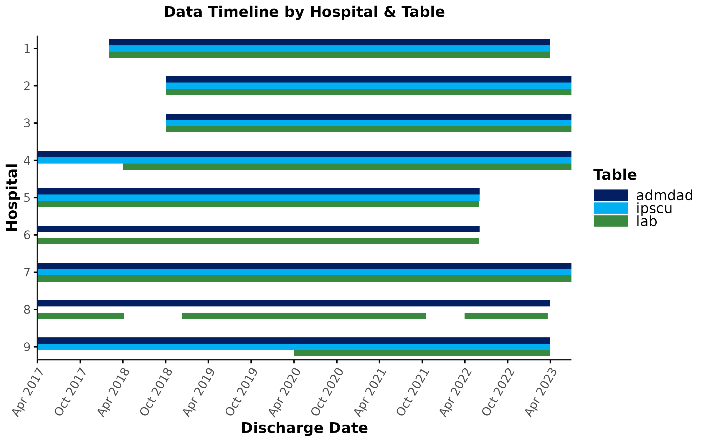
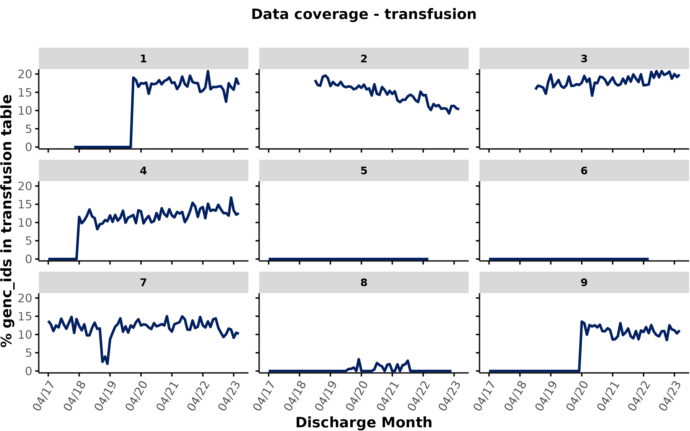
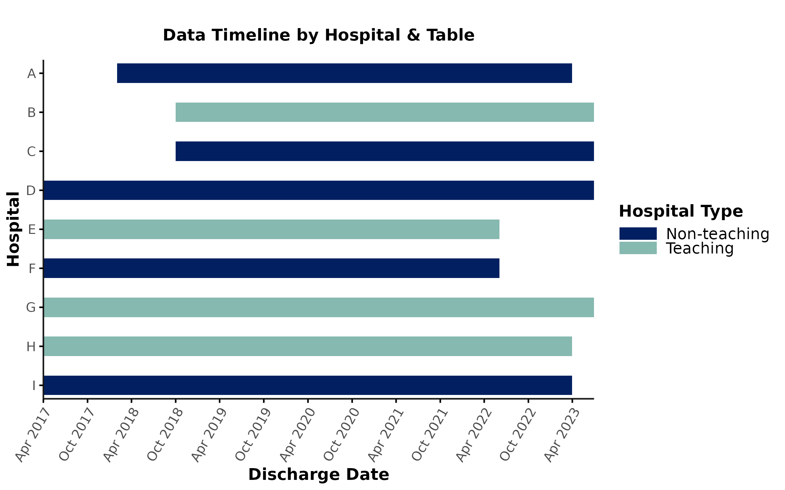
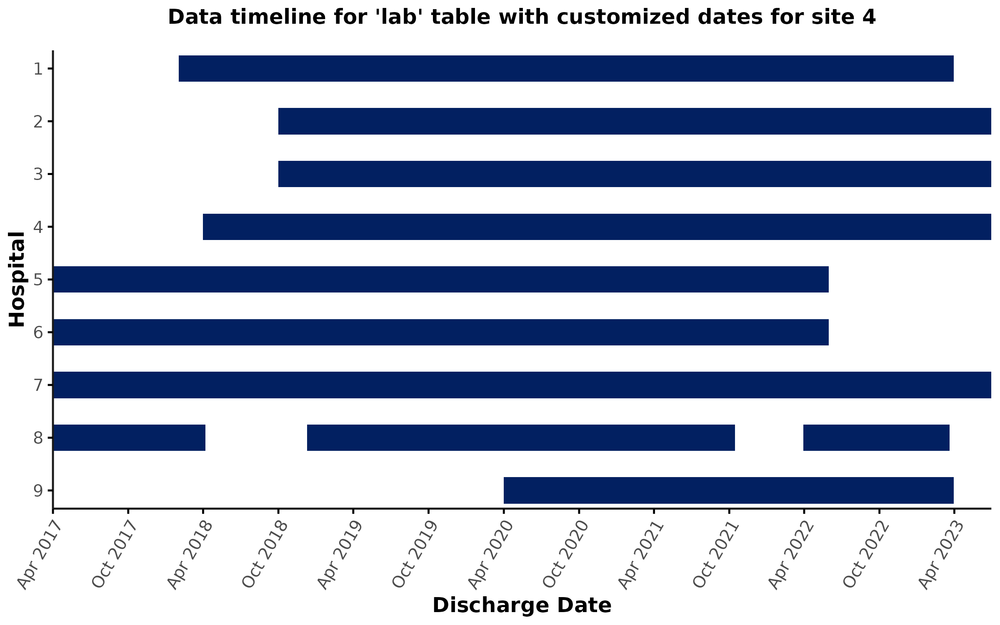

# Data Coverage

------------------------------------------------------------------------

## Introduction

The
[`data_coverage()`](https://gemini-medicine.github.io/Rgemini/reference/data_coverage.md)
function facilitates commonly performed data coverage checks and is
meant as a **starting point** for data coverage exploration.

Although GEMINI aims to achieve high coverage of all data elements, it’s
possible that some tables could not be fully extracted from certain
hospitals/time periods. This is especially true for clinical variables,
such as lab, transfusion, radiology, or pharmacy data.

Therefore, one of the first steps of any analysis with GEMINI data
should be to carefully check data coverage for all relevant tables.
Depending on the research question, this may inform study feasibility,
cohort creation, decisions about imputation of missing values, and/or
modelling choices.

**Expand this section for an example**

If the goal of a project is to compare patients who received a blood
transfusion vs. those who did not, researchers first need to check data
coverage for the transfusion table. In this scenario, users cannot
simply check whether a given `genc_id` has an entry in the transfusion
table because there are 2 possible reasons for why a `genc_id` might not
exist in the transfusion table:

1.  ***Clinical reason:*** A transfusion may not have been indicated
    (i.e., the patient did indeed not receive a transfusion).
2.  ***Data coverage issue:*** The patient did receive a blood
    transfusion, but the GEMINI transfusion table does not contain the
    corresponding `genc_id` due to data coverage issues (e.g., data
    extraction issue).

We need to be able to differentiate between these 2 scenarios to
distinguish:

1.  ***True negatives:*** I.e., patient did indeed not receive a
    transfusion, so we can set `transfused` to `FALSE`.
2.  ***Transfusion status unknown:*** I.e., we do not have sufficient
    data coverage to know whether the patient received a transfusion, so
    we should set `transfused` to `NA` (or exclude patients without
    transfusion coverage from the cohort).

Additionally, if the goal is to analyze differences in transfusion
practices across hospitals, we also need to check whether there are
differences in data coverage timelines across sites. For example, if
some hospitals only have transfusion data *before* 2020, whereas other
hospitals only have transfusion data *after* 2020, any between-hospital
differences we observe may in fact be driven by changes in transfusion
practices over time (rather than reflecting true differences between
hospitals). We therefore need to carefully consider which hospitals &
time periods to include in our analyses, and how to account for
differences in data coverage periods.

  

This vignette focuses on data coverage checks at the level of
**tables** - not individual columns within a given table. This is
because table-level data coverage is typically more challenging to
analyze and requires a thorough inspection and understanding of the
GEMINI cohort. By contrast, column-level missingness within a single
table can easily be checked using
[`Rgemini::n_missing()`](https://gemini-medicine.github.io/Rgemini/reference/n_missing.html).
Column-level missingness should typically follow the table-level
coverage checks discussed here.

  
  

## Data coverage lookup table

The
[`data_coverage()`](https://gemini-medicine.github.io/Rgemini/reference/data_coverage.md)
function queries the `lookup_data_coverage` table, which lists the time
periods with coverage for each data table and hospital (also see Data
Availability plot in the [Data
Dictionary](https://geminimedicine.ca/the-gemini-database/)). The
min/max dates refer to the range of **discharge dates** (from `admdad`)
during which there was **at least 1 `genc_id`** with an entry in a given
table:

``` r
lookup_data_coverage <- dbGetQuery(
  db, "SELECT * from lookup_data_coverage;"
) %>% data.table()
```

> This is an example (dummy version) of the `lookup_data_coverage` table
> showing the min-max coverage dates for different hospital\*data
> combinations:

|    data     | hospital_num |  min_date  |  max_date  |           additional_info           |
|:-----------:|:------------:|:----------:|:----------:|:-----------------------------------:|
|   admdad    |      1       | 2018-02-01 | 2023-03-31 |  Hospital opened in February 2018.  |
|     er      |      2       | 2015-04-01 | 2023-06-30 |                                     |
|  pharmacy   |      3       | 2019-07-01 | 2023-03-31 |                                     |
|  radiology  |      4       | 2017-01-01 | 2023-06-30 |                                     |
| transfusion |      5       | 2015-04-01 | 2022-05-31 |                                     |
|    ipscu    |      6       |     NA     |     NA     |   Hospital does not have an ICU.    |
| ipdiagnosis |      7       | 2015-04-01 | 2023-06-30 |                                     |
|     lab     |      8       | 2017-04-01 | 2018-04-07 | Hospital provides specialized care. |
|     lab     |      8       | 2018-12-10 | 2021-10-15 | Hospital provides specialized care. |
|     lab     |      8       | 2022-03-30 | 2023-03-20 | Hospital provides specialized care. |
| physicians  |      9       | 2016-04-01 | 2023-03-31 |                                     |

  

**Additional notes:**

- The min/max dates in each row correspond to the start/end date of a
  single data coverage period by hospital\*table.
- Hospital\*table combinations with interrupted timelines are shown
  across multiple rows (e.g., 3 rows for lab data at site 8).
- Gaps in data coverage are defined as a period of \>28 consecutive days
  without any data.
- Rows where the dates are `NA` indicate hospital\*table combinations
  for which GEMINI does not have any data at all. This could either mean
  that the data are not relevant to a given site (e.g., hospital 6 does
  not have an ICU) or that the data could not be successfully extracted.
- Encounters with a discharge date within the listed min-max periods are
  assumed to have ***at least some*** data coverage for that table,
  although coverage may still be low (see
  [plot_coverage](#plot_coverage) below).
- The `additional_info` column contains information that may be helpful
  when interpreting the output of the
  [`data_coverage()`](https://gemini-medicine.github.io/Rgemini/reference/data_coverage.md)
  function. When running
  [`data_coverage()`](https://gemini-medicine.github.io/Rgemini/reference/data_coverage.md),
  the function automatically prints all relevant rows from this column
  in the terminal.

  

**WARNING:** **Our threshold for data coverage is currently extremely
low!** We assume that there is **some** data coverage if there is **at
least 1 `genc_id`** with an entry in a given table. This does not tell
us how high data coverage actually is (e.g., was there only 1 `genc_id`
or 1,000 `genc_ids` with an entry in a given table?). Additionally, the
definition only considers gaps \>28 days, and does not exclude time
periods with shorter gaps. Therefore, users should only use this lookup
table (and the accompanying
[`data_coverage()`](https://gemini-medicine.github.io/Rgemini/reference/data_coverage.md)
function) as a starting point - to exclude time periods where GEMINI did
not receive any data at all. We highly recommend performing additional
coverage checks, in combination with data quality assessments.

  
  

## How to use `data_coverage()`

### Get encounter-level coverage flag (without plots)

The
[`data_coverage()`](https://gemini-medicine.github.io/Rgemini/reference/data_coverage.md)
function converts the `lookup_data_coverage` table to an encounter-level
table. Let’s say we want to check which encounters in `admdad` were
discharged during time periods with any `lab`, `transfusion`, and
`radiology` data coverage:

``` r
# Get encounter-level coverage flags
coverage <- data_coverage(
  dbcon = db,
  cohort = admdad,
  table = c("lab", "transfusion", "radiology"),
  plot_timeline = FALSE,
  plot_coverage = FALSE
)
```

> This is an example (dummy version) of the ouput table returned by
> [`data_coverage()`](https://gemini-medicine.github.io/Rgemini/reference/data_coverage.md):

| genc_id | hospital_num | discharge_date |  lab  | transfusion | radiology |
|:-------:|:------------:|:--------------:|:-----:|:-----------:|:---------:|
|    1    |      1       |   2019-12-31   | TRUE  |    FALSE    |   FALSE   |
|    2    |      2       |   2022-03-12   | TRUE  |    TRUE     |   TRUE    |
|    3    |      3       |   2018-10-10   | TRUE  |    TRUE     |   TRUE    |
|    4    |      4       |   2017-10-15   | FALSE |    TRUE     |   TRUE    |
|    5    |      5       |   2022-06-01   | FALSE |    FALSE    |   TRUE    |
|    6    |      6       |   2018-12-22   | TRUE  |    FALSE    |   TRUE    |
|    7    |      7       |   2022-05-20   | TRUE  |    TRUE     |   TRUE    |
|    8    |      8       |   2021-07-30   | TRUE  |    FALSE    |   TRUE    |
|    9    |      9       |   2017-08-03   | FALSE |    TRUE     |   TRUE    |

  

The table contains a flag for each `genc_id` indicating whether that
`genc_id` was discharged from a hospital & during a time period where
**some** lab/transfusion/radiology data were available (according to the
min-max dates in the [`lookup_data_coverage`](#lookup_coverage) table).

- **For `genc_ids` where the flag is `FALSE`**: Based on the definition
  of data coverage in the lookup table, these are encounters that were
  discharged from hospitals/during time periods where GEMINI did not
  receive ANY data all for a period of \>28 days. In other words, we do
  not have sufficient data coverage to infer whether the encounter
  received a lab/imaging test or transfusion. Therefore, these
  `genc_ids` should be excluded (or set to `NA`) for any analyses
  relying on lab/transfusion/radiology data.
- **For `genc_ids` where the flag is `TRUE`**: These are encounters that
  were discharged from hospitals/during time periods with **some** data
  coverage. This does *not* mean that all `genc_ids` where the flag is
  `TRUE` have an entry in the lab/transfusion/radiology table because:
  1.  Due to the low threshold for data coverage in the
      `lookup_data_coverage` table, actual data coverage may still be
      low during some time periods (see
      [`plot_coverage`](#plot_coverage) below).
  2.  For some tables, we would not expect all `genc_ids` to have an
      entry even if data coverage is generally high (e.g., not all
      patients receive a radiology test or blood transfusion).

  

### Plot data timelines by table & hospital

To visualize the data timelines by hospital & table, you can set the
`plot_timeline` input to `TRUE`, which will result in a plot similar to
the “Data Availability” plot in the data dictionary. However, the plot
returned by this function is customized to the input cohort (e.g., time
periods/hospitals of interest) and specific tables that are relevant for
your analyses.

For example, let’s say we are interested in the data timelines for the
`admdad`, `lab`, and `ipscu` table for encounters discharged since April
2017:

``` r
# Get encounters discharged since Apr 2017
admdad_subset <- admdad[discharge_date_time >= "2017-04-01 00:00", ]

# Plot data timelines
coverage <- data_coverage(
  dbcon = db,
  cohort = admdad_subset,
  table = c("admdad", "lab", "ipscu"),
  plot_timeline = TRUE,
  plot_coverage = FALSE
)
```



  

**Let’s inspect this plot. What should you look out for?**

**Expand this section for some tips**

- **Between-hospital differences in data timelines**
  - Looking at the timelines for `admdad`, you’ll notice that some
    hospitals generally have later start dates (e.g., hospital 1) and/or
    earlier end dates (e.g., hospitals 5 & 6) compared to others. The
    `additional_info` column in the `lookup_data_coverage` table may
    provide an explanation for some of these between-hospital
    differences in data timelines (e.g., see above, for hospital 1:
    “Hospital opened in February 2018.”). Depending on your research
    question, you may need to restrict your analyses to time periods
    that overlap across all sites and/or exclude sites with limited data
    timelines.
- **Within-hospital differences in data timelines**
  - Even within the same hospital, data timelines can vary between
    tables. For example at sites 4 and 9, lab data have a shorter
    coverage period compared to `admdad`/`lab` data. This is typically
    due to challenges associated with extracting clinical (as opposed to
    administrative) data. If lab data are crucial for your research
    question, keep in mind that the effective data timeline for your
    analyses is determined by lab data coverage (rather than `admdad`
    coverage).
- **Interrupted data timelines**
  - For some hospitals/tables, data timelines may be interrupted. For
    example, at site 8, lab data are not covered continuously. The
    `additional_info` column may contain some information that can help
    interpretation. For example, for site 8 lab data, the table states
    that this “Hospital provides specialized care”. It’s possible that
    lab testing is not performed on a routine basis at specialized
    hospitals and that the % of encounters with lab tests is generally
    very low even for time periods that are shown as “covered” in the
    timeline plot (remember that a single `genc_id` with lab data is
    sufficient for data coverage to be shown as `TRUE` in this plot). In
    other words, the gaps in the data timeline might not necessarily
    reflect a data extraction issue, but rather could be an indicator of
    specialized clinical practice at this site. Therefore, it is
    important to inspect overall data volume for sites with interrupted
    data timelines and plot the % data coverage (see
    [plot_coverage](#plot_coverage) below). If lab data are crucial for
    your research question, you may consider exlcuding specialized
    hospitals with low lab data coverage/volume.
- **Empty rows**
  - Some tables may not appear in the timeline plot at all for certain
    hospitals. For example, sites 6 & 8 have an empty `ipscu` row.
    According to the `additional_info` column in the
    `lookup_data_coverage` table, site 6 does not have an ICU. This
    information can help us determine how to deal with this site in our
    analyses. For example, if we are simply looking at the `ipscu` table
    to determine if a `genc_id` was admitted to an ICU during their
    hospitalization, we can still include site 6 in our analyses and set
    `icu_entry` to `FALSE` for all encounters at this site (we know for
    a fact that patients were not admitted to an ICU while being
    hospitalized at site 6). By contrast, if we are planning to perform
    more in-depth analyses of `ipscu` data (e.g., analyses of lab tests
    performed in the ICU), site 6 would need to be excluded since it
    would not contribute any data points to those analyses.

  
  

In addition to the plot, the function also returns a list object with
several entries:

- The 1st list item (`coverage_flag_enc`) contains the table with
  encounter-level flags based on `lookup_data_coverage` (also see
  section above):

``` r
coverage[[1]] # = coverage$coverage_flag_enc
```

| genc_id | hospital_num | discharge_date | admdad | ipscu | lab   |
|--------:|:-------------|:---------------|:-------|:------|:------|
|       1 | 1            | 2018-09-13     | TRUE   | TRUE  | TRUE  |
|       2 | 7            | 2023-02-01     | TRUE   | TRUE  | TRUE  |
|       3 | 7            | 2023-01-20     | TRUE   | TRUE  | TRUE  |
|       4 | 1            | 2018-07-10     | TRUE   | TRUE  | TRUE  |
|       5 | 9            | 2019-10-10     | TRUE   | TRUE  | FALSE |
|       6 | 4            | 2019-09-21     | TRUE   | TRUE  | TRUE  |
|       7 | 9            | 2020-12-26     | TRUE   | TRUE  | TRUE  |
|       8 | 4            | 2020-12-06     | TRUE   | TRUE  | TRUE  |
|       9 | 4            | 2019-04-23     | TRUE   | TRUE  | TRUE  |
|      10 | 9            | 2022-03-02     | TRUE   | TRUE  | TRUE  |

  

- The 2nd list item (`timeline_data`) is the DB availability table with
  min-max dates per site & table (i.e., what’s shown in the data
  timeline plot)

``` r
coverage[[2]] # = coverage$timeline_data
```

| hospital_num | data   | min_date   | max_date   | additional_info |
|:-------------|:-------|:-----------|:-----------|:----------------|
| 1            | admdad | 2018-02-01 | 2023-03-31 | NA              |
| 1            | ipscu  | 2018-02-01 | 2023-03-31 | NA              |
| 1            | lab    | 2018-02-01 | 2023-03-31 | NA              |
| 2            | admdad | 2018-10-01 | 2023-06-30 | NA              |
| 2            | ipscu  | 2018-10-01 | 2023-06-30 | NA              |
| 2            | lab    | 2018-10-01 | 2023-06-30 | NA              |
| 3            | admdad | 2018-10-01 | 2023-06-30 | NA              |
| 3            | ipscu  | 2018-10-01 | 2023-06-30 | NA              |
| 3            | lab    | 2018-10-01 | 2023-06-30 | NA              |
| 4            | admdad | 2017-04-01 | 2023-06-30 | NA              |

  

- The 3rd list item (`timeline_plot`) is a ggplot object containing the
  timeline plot, which can be further customized/exported in the desired
  format.

  For example, you could customize the title of the plot and move the
  legend position:

``` r
coverage[[3]] + # = coverage$timeline_plot
  ggtitle("Data coverage exploration\n\n", subtitle = "GEMINI project XYZ") +
  theme(legend.position = "top")
```

  
  

### Plot % data coverage

The encounter-level flags and timeline plot only provide very limited
insights into actual data coverage, since they simply reflect the
min-max dates listed in the `lookup_data_coverage` table, which lists
all time periods with any data even if just 1 `genc_id` had a table
entry. This is problematic because there may be time periods with very
low coverage that aren’t currently excluded from the
`lookup_data_coverage` table. Therefore, users should always perform
additional coverage checks by plotting the % of encounters with an entry
in a given table by hospital & month. This can be achieved by setting
the `plot_coverage` input to `TRUE`. Users should then carefully inspect
the coverage over time and decide how to handle time periods/hospitals
with low coverage in their analyses.

**WARNING:** When plotting data coverage, your cohort input should only
be pre-filtered for the hospitals and overall timelines of interest. You
**should not** apply any other cohort inclusion/exclusion criteria
(e.g., diagnosis codes etc.). This is to ensure that the coverage plots
are representative of the overall GEMINI data holdings, and are not
skewed by any project-specific cohort inclusion/exclusion steps.

  

Let’s plot coverage for the transfusion table for patients discharged
since April 2017:

``` r
# Plot coverage (% genc_ids with entry in table)
coverage <- data_coverage(
  dbcon = db,
  cohort = admdad_subset,
  table = c("transfusion"),
  plot_timeline = FALSE,
  plot_coverage = TRUE
)
```



  

The expected percentage of `genc_ids` with an entry in a given table
depends on the clinical context & differences in practice across sites
(e.g., how many patients receive a transfusion vs. a lab/imaging test
etc.). Therefore, there is no single threshold that can be applied to
define “good” coverage across different tables/hospitals.

**With that in mind, how would you evaluate this coverage plot for
transfusion data?**

**Expand this section to learn more**

Users should carefully inspect these plots for unexpected patterns
(e.g., sudden drops) and further inspect a) what’s driving these
patterns, and b) how to handle time periods with low data coverage in
their analyses. Here are a few specific examples of what to look out
for:

- **Hospitals/time periods with no data coverage**
  - Some hospitals don’t have any transfusion data at all (e.g., sites 5
    & 6) or don’t have any transfusion coverage during certain time
    periods (e.g., hospital 1/4/8/9).\* Note that time periods with 0%
    coverage could also be inferred from the timeline plot, which would
    have empty rows for any tables without any data coverage (see
    [`plot_timeline`](#plot_timeline)). However, the coverage plots
    provide more granular insights into coverage - beyond 0 vs. non-0 -
    allowing users to compare coverage between hospitals and over time
    on a continuous scale.
- **Differences between hospitals**
  - For hospitals with transfusion data, we may see large differences in
    the % of encounters with an entry in the transfusion table (e.g.,
    \>15% at site 3 vs. \<5% at site 8). This may not necessarily
    reflect differences in data coverage, but could be due to
    differences in clinical practice or medical subservices provided at
    different sites. As discussed above, we already know that site 8
    provides specialized care. To check whether this might explain low
    transfusion rates, users could inspect the medical subservices
    provided at this site (e.g., `mrp_service` field in `admdad`) and
    could also check for potential differences in patient populations
    (e.g., most responsible diagnosis groups) at different sites. If
    transfusion data are crucial for the research question of interest,
    it may make sense to exclude hospitals with low transfusion data
    volume.
- **Sudden drops in data coverage**
  - At hospital 7, we can see a large drop in the % transfusion coverage
    in the first quarter of 2019. Sudden, temporary drops like this
    typically reflect a data coverage issue (e.g., due to data
    extraction challenges, EHR transition etc.). Occassionally, these
    drops could also be due to temporary changes in clinical practice
    (e.g., COVID-19 waves, blood product shortages etc.) - although we
    would typically expect these changes to be more gradual and affect
    all hospitals. Depending on your research question, you may need to
    remove hospitals/time periods with low data coverage from your
    analyses, especially if you suspect a data coverage issue. Note that
    coverage drops like this would not be reflected in the timeline plot
    shown above because coverage was \> 0%.
- **Gradual changes in coverage over time**
  - At site 2, we can observe a gradual decrease in the % of encounters
    with a transfusion. This could be due to several different reasons:
    1.  There may have been a change in clinical practice over time
        (e.g., new transfusion guidelines specific to this site)
    2.  Changes in the patient cohort/medical subspecialties: It’s worth
        inspecting if patient characteristics remained constant over
        time, or whether there are reasons you’d expect transfusion
        rates to decrease over time (e.g., larger proportion of patients
        with no medical indication for a transfusion?)
    3.  It’s possible that gradual changes in coverage are driven by
        data extraction issues. For example, later time periods may be
        missing transfusion entries for a certain subset of the GEMINI
        cohort (e.g., ICU patients). Hence, it could be worth plotting
        coverage for different patient cohorts separately (see cohort
        flags like `gim` or `all_med` in the `derived_variables` table).
    4.  Finally, note that we are plotting data coverage by discharge
        month here (rather than transfusion month). This can potentially
        mask issues related to the extraction of transfusion products
        that were transfused during certain time periods. We therefore
        recommend plotting coverage by the relevant clinical date-time
        variable (i.e., issue_date_time for transfusions) in addition to
        the plots by discharge_date_time. Note that this is currently
        not supported by data_coverage() but can easily be achieved
        using Rgemini::plot_over_time() (e.g., time_var would be
        issue_date_time in the case of transfusions). This may show a
        more abrupt drop in data coverage and could indicate issues with
        data storage in the hospital’s EHR (e.g., system outage) rather
        than data extraction issues (which are typically related to
        discharge_date_time since GEMINI data are pulled by discharge
        date).

  

\*\*As a side note: 0 in the coverage plot indicates that there were
some encounters in the cohort during these time periods (i.e., `admdad`
data are available), but none of the encounters had an entry in the
`transfusion` table. By contrast, time periods that are not covered in
the cohort/admdad table are shown as `NA` in these plots. For example,
at site 1, we can see that the cohort only starts in February 2018 in
line with the `additional_info` column stating that this hospital only
opened in February 2018. between Feb 2018 - Jan 2020, GEMINI did not
receive any transfusion data for the encounters from this site (%
coverage = 0). Since January 2020, GEMINI has started receiving
transfusion data with ~15-20% of encounters having an entry in the
transfusion table at this site.

  

In addition to printing the coverage plot, the function will also return
a list object similar to the one above:

1.  `coverage_flag_enc`: Encounter-level data coverage flag
2.  `coverage_data`: Table showing the % of encounters with a table
    entry by hospital & discharge month
3.  `coverage_plot`: ggplot object containing coverage plot

Here is an example of the `coverage_data` table, which can be used to
detect (and exclude) hospitals/months with low coverage. It also shows
the number of encounters (`n_encounters`) that are in the denominator
for each hospital \* month combination based on the user-provided cohort
input.

``` r
coverage[[2]] # = coverage$coverage_data
```

| discharge_month | hospital_num | prct_transfusion_entry | n_encounters |
|:----------------|:-------------|-----------------------:|-------------:|
| 2017-04-01      | 1            |                     NA |           NA |
| 2017-04-01      | 2            |                     NA |           NA |
| 2017-04-01      | 3            |                     NA |           NA |
| 2017-04-01      | 4            |                   0.00 |          533 |
| 2017-04-01      | 5            |                   0.00 |         1145 |
| 2017-04-01      | 6            |                   0.00 |          700 |
| 2017-04-01      | 7            |                  13.74 |          844 |
| 2017-04-01      | 8            |                   0.00 |            1 |
| 2017-04-01      | 9            |                   0.00 |          652 |
| 2017-05-01      | 1            |                     NA |           NA |

  
  

## Further customization

### `hospital_label` & `hospital_group`

Users can further customize the timeline & coverage plots by providing
`hospital_label` (e.g., letters A-E instead of `hospital_num` 101-105)
and/or `hospital_group` (e.g., “Teaching” vs. “Non-teaching hospital”)
inputs.

For example, let’s say our `admdad_subset` table contains a user-created
label (`hosp_label`) and hospital grouping variable (`hosp_type`). We
can now provide these variable names as inputs to `data_coverage`:
`hospital_label` will change the labels of hospitals on the y-axis of
the timeline plot whereas `hospital_group` will color code hospitals
according to their category. We can also customize the color scheme by
providing a `colors` input:

``` r
coverage <- data_coverage(
  dbcon = db,
  cohort = admdad_subset,
  table = c("admdad"),
  plot_timeline = TRUE,
  plot_coverage = FALSE,
  hospital_label = "hosp_label",
  hospital_group = "hosp_type",
  colors = gemini_colors(3)
)
```



  

### `custom_dates`

In some cases, users may want to provide customized timelines for a
given hospital\*table combination to apply further inclusions/exclusions
(e.g., due to data quality issues, column-level missingness, etc.). For
example, let’s say you identified a data quality issue with lab data at
hospital 4 for discharge dates prior to April 2019 and now only want to
include encounters that were discharged after that date. This can be
achieved by providing a `custom_dates` input to
[`data_coverage()`](https://gemini-medicine.github.io/Rgemini/reference/data_coverage.md),
which will overwrite the rows for the corresponding hospital\*table
combinations in the `lookup_data_coverage` table. As a result, the
encounter-level flags and timeline plot will be adjusted according to
the user-specified dates. Note that the coverage plot (see
[above](#coverage_plot)) is not affected by the `custom_dates` input.

``` r
# define customized dates
custom_dates <- data.table(
  data = c("lab"),
  hospital_num = c(4),
  min_date = "2019-04-01",
  max_date = "2023-06-30"
)

coverage <- data_coverage(
  db = dbcon,
  cohort = admdad_subset,
  table = c("lab"),
  plot_timeline = TRUE,
  plot_coverage = FALSE,
  custom_dates = custom_dates
)
```



  

### `as_plotly`

Finally, users can set `as_plotly` to `TRUE`. This will return any
figures created by
[`data_coverage()`](https://gemini-medicine.github.io/Rgemini/reference/data_coverage.md)
as `ggplotly` objects, which facilitates interactive exploration of the
timeline/coverage plots. Note that this is currently not supported on
HPC4Health due to vulnerabilities associated with the `plotly` package.
