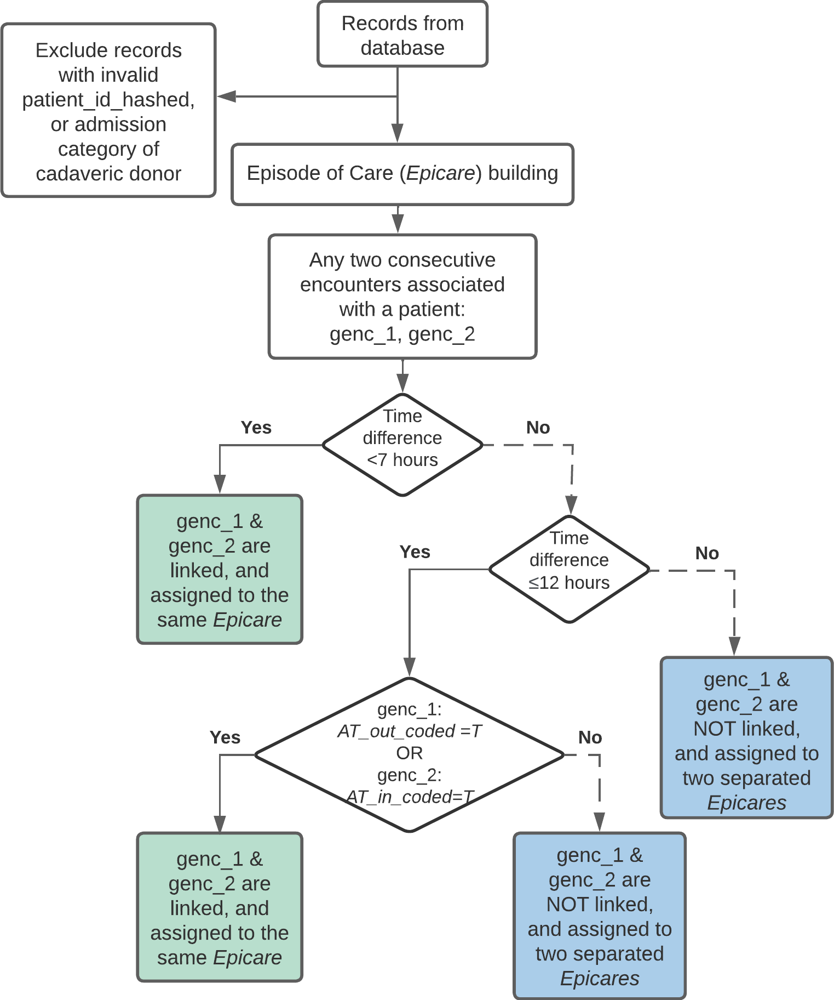

# Episodes of care and Readmission

## Introduction

This vignette contains detailed information about two functions that are
closely related to each other:
[`episodes_of_care()`](https://gemini-medicine.github.io/Rgemini/reference/episodes_of_care.md)
and
[`readmission()`](https://gemini-medicine.github.io/Rgemini/reference/readmission.md).
The `episodes_of_care` function is used in the `readmission`
calculations in order to avoid that encounters that are linked via
transfers (i.e., are part of the same episode of care) are counted as
readmissions. The definitions used in both functions are based on CIHI
guidelines for readmission calculations (see
[here](https://www.cihi.ca/en/indicators/all-patients-readmitted-to-hospital)).

### `episodes_of_care()`

The function
**[`episodes_of_care()`](https://gemini-medicine.github.io/Rgemini/reference/episodes_of_care.md)**
links together hospitalizations with acute care transfers into unique
episodes of care. For each hospitalization (`genc_id`), the function
returns the corresponding: `patient_id_hashed`,
`time_to_next_admission`, `time_since_last_admission`, `AT_in_coded`,
`AT_out_coded`, `AT_in_occurred`, `AT_out_occurred`, `epicare`.

- **Coded Transfers (*AT_in_coded*, *AT_out_coded*):** A coded acute
  care transfer refers to hospital coding of acute care transfers based
  on DAD `institution_from` and `institution_to` fields. Specifically, a
  hospitalization has a coded transfer-in (`AT_in_coded = T`), if the
  `lookup_transfers` table lists `institution_from_type_mns == 'AT'` for
  a given `genc_id` (and `AT_out_coded = T` if
  `institution_to_type_mns == 'AT'`).

- **Occurred Transfers (*AT_in_occurred*, *AT_out_occurred*):** An acute
  care transfer is assumed to have occurred (`AT_in_occurred = T`,
  `AT_out_occurred = T`) if either of the following criteria are met:

> - An admission to a GEMINI hospital within 7 hours after discharge
>   from another GEMINI hospital, regardless of whether the transfer is
>   coded by hospital.

> - An admission to a GEMINI hospital within 7-12 hours after discharge
>   from another GEMINI hospital, and at least 1 hospital has coded the
>   transfer.

- **Episode of Care (*epicare*):** An episode of care refers to all
  contiguous inpatient hospitalizations within the GEMINI network.
  Contiguous inpatient hospitalizations are defined based on occurred
  transfers (`AT_in_occurred == T` or `AT_out_occurred == T`). Episodes
  involving inter-facility transfers are linked regardless of diagnosis.

> The flowchart below shows how epicares are built:



> Example output of `episodes_of_care(db)` (mock data for illustration
> purposes, not real data):


**Note:** For database versions `drm_cleandb_v4`/`H4H_template_v5` or
newer, the `epicare` variable in the `derived_variables` table was
derived exclusively based on encounters with a medical/special care unit
(SCU) touchpoint since these encounters are consistently available
across hospitals and represent the main patient population of interest
for readmission calculations used in research projects/quality reports.
For all other in-patient encounters (e.g., surgery patients available at
some sites), `epicare = NA`. See [*Section 3.4*](#sectionrecohort) for
options to compute episodes of care using other, customized cohorts.

### `readmission()`

The function
**[`readmission()`](https://gemini-medicine.github.io/Rgemini/reference/readmission.md)**
computes whether or not a patient associated with an epicare was
readmitted to a GEMINI hospital within a specified time window. For each
hospitalization (`genc_id`), the function returns its corresponding:
`AT_in_occurred`, `AT_out_occurred`, `epicare`, and `readmitX`.
`readmitX` is a boolean variable denoting whether readmission took place
during a time window X-days post-discharge.

It is important to realize that readmission is determined by looking
forward into data in the future. Therefore, `readmitX` is a measurement
of quality of care of the current episode and evaluates whether factors
in the current episode **LEAD** to readmission in the future.

For episodes of care involving acute care transfers, readmissions are
attributed to the **LAST hospitalization** from which the patient was
discharged before readmission; namely only the last `genc_id` of an
episode has `readmitX` assigned, the rest are set to `NA`.

> Mock example output of `readmission(db)` (mock data for illustration
> purposes, not real data. patient_id added to facilitate
> interpretation):


**Note:** For database versions `drm_cleandb_v4`/`H4H_template_v5` or
newer, the `readmission` flags in the `derived_variables` table were
derived exclusively based on encounters with a medical/SCU touchpoint
since these encounters are consistently available across hospitals and
represent the main patient population of interest for readmission
calculations used in research projects/quality reports. For all other
in-patient encounters (e.g., surgery patients available at some sites),
`readmission = NA`. See [*Section 3.4*](#sectionrecohort) for options to
compute readmission flags using other, customized cohorts.

#### General readmission rate calculation

- **Denominator of Readmission Rate:** Total number of episodes with
  potential to be readmitted. There are various conditions where
  episodes are removed from the denominator. For example, episodes
  discharged as death cannot be readmitted, and are therefore removed
  from the denominator of readmission rates by default (see details in
  [*Section 2 CIHI flags*](#sectionCIHI)).

> An episode is removed from the ***Denominator*** by setting
> **`readmitX = NA`** for the **current episode**.

- **Numerator of Readmission Rate:** Number of episodes within the
  denominator that were actually readmitted within the time window of
  interest. There are various conditions where episodes are removed from
  the numerator. For example, elective admissions might not be
  considered as readmissions, and are therefore removed from the
  numerator by default (see details in [*Section 2 CIHI
  flags*](#sectionCIHI)).

> An episode is removed from the ***Numerator*** by setting
> **`readmitX = F`** for the **preceding episode**.

Typically, we recommend using the `readmission_Xd_derived` variables in
the `derived_variables` table to calculate readmission rates since these
flags were derived using all adult medicine/SCU encounters available in
GEMINI data, and therefore, provide the most reliable estimates of
readmission rates. However, if you want to calculate readmission flags
yourself, the following code illustrates how to calculate 7-day
readmissions using the default arguments in the
[`readmission()`](https://gemini-medicine.github.io/Rgemini/reference/readmission.md)
function. Note that this example uses all encounters available in your
database/data cut to derive episodes of care and subsequent
readmissions. This may not be desirable, depending on your
project-specific definition of readmission rates (also see [*Section
3.4*](#sectionrecohort)):

``` r
# Load necessary libraries:
library(RPostgreSQL)
library(DBI)
library(getPass)

# Establish database connection
db <- DBI::dbConnect(drv,
  dbname = "db",
  host = "domain_name.ca",
  port = 1234,
  user = getPass("Username: "),
  password = getPass("Password: ")
)

# Run default readmission calculation (with elective_admit = T and death = T)
# this derives epicares/readmission based on all genc_ids in the database/datacut
readm <- readmission(db)

# Compute readmission rate based on readmission output
denominator <- sum(!is.na(readm$readmit7))
numerator <- sum(readm$readmit7, na.rm = T)
readmission_7d_derived <- numerator / denominator

# Compute readmission rate based on readmission output (Alternative)
readmission_7d_derived <- mean(readm$readmit7, na.rm = T)
```

#### GEMINI specific considerations

##### Readmission attribution when end of episode is unknown

- When the last hospitalization of an epicare has transfer out coded
  (`AT_out_coded` == T) and `time_to_next_admission` is greater than 12
  hours or infinite, it suggests that the patient likely had been
  transferred to a hospital/service **not captured in GEMINI data**. It
  cannot be known for certain that the last hospitalization in our
  records is the last hospitalization of the epicare in reality.

- To avoid inaccurate attribution of potential readmission, such
  epicares are **excluded from the denominator (`readmitX = NA`)**.

> Hypothetical example of special readmission attribution (compare
> colored entries in genc_id 103 vs 301, and genc_id 105 vs 201, and see
> how readmit7 is affected):

  

##### Buffer period based on each hospital’s data availability

- A patient needs to be discharged from hospital before appearing in the
  GEMINI database. If a patient was readmitted to a hospital but has not
  yet been discharged by the time data is transferred to GEMINI, that
  readmission record will not be captured in our database. As a result,
  readmission rates could be underestimated in the time period before
  the latest data transfers.

- To mitigate this bias, **a buffer period** based on data availability
  of each hospital is applied to the readmission calculation. If an
  episode’s discharge time is in the buffer period, the epicare is
  **excluded from the denominator (`readmitX = NA`)** of readmission
  rates.

> Buffer Period =  
> \[ (Hospital’s last discharge date - Readmission window - Additional
> 30 days)  
> , (Hospital’s last discharge date) \]

- The buffer period is derived as follows:
  - The X number of days specified by the readmission window must have
    passed to allow for X-day readmission to occur;
  - 95% of hospital admissions are discharged within 30 days based on
    GEMINI data. Therefore, an additional 30 days are included in the
    buffer period to exclude any patients who may not yet have been
    discharged from their readmission encounter;
  - The buffer period is determined by the data availability timeline of
    the hospital where the index admission occurred (since the majority
    of readmissions occur at the same hospital as the index admission).
    However, it is possible that there are inter-hospital biases, which
    cannot be addressed with the current data available in GEMINI.

> Hypothetical example of how buffer period affects 7-day readmission of
> a patient:


#### Customizable features

- **CIHI flags:** see [*Section 2 CIHI flags*](#sectionCIHI).

- **Readmission time window:** By default, the
  [`readmission()`](https://gemini-medicine.github.io/Rgemini/reference/readmission.md)
  function computes 7-day and 30-day readmission rates. Users have the
  option to specify a customized time window using the `readm_win`
  argument (see [*Section 3.3*](#sectionrewin) for details).

- **Restricted cohort:** By default, the `readmission` function includes
  all encounters in the database. Depending on your database version and
  project-specific needs, this may not be desirable. Both the
  [`episodes_of_care()`](https://gemini-medicine.github.io/Rgemini/reference/episodes_of_care.md)
  and
  [`readmission()`](https://gemini-medicine.github.io/Rgemini/reference/readmission.md)
  functions therefore allow users to input a customized cohort using the
  `restricted_cohort` argument (see [*Section 3.4*](#sectionrecohort)
  for details). For example, the episodes of care and readmission values
  in the `derived_variables` table are meant to reflect scenarios where
  acute hospitalizations involving a medical/SCU touchpoint were
  subsequently followed by a readmission involving another medical/SCU
  touchpoint (while ignoring potentially scheduled admissions to other
  in-patient services like surgery). Therefore, in
  `drm_cleandb_v4`/`H4H_template_v5` or newer, the epicare/readmission
  values were derived using `restricted_cohort = rbind(all_med, ipscu)`,
  capturing all encounters with `derived_variables$all_med == TRUE` or
  an entry in the `ipscu` table.

- **Return readmission encounters:** By default, the
  [`readmission()`](https://gemini-medicine.github.io/Rgemini/reference/readmission.md)
  function only returns TRUE/FALSE based on whether the `genc_id` was
  followed by a subsequent readmission. There may be scenarios where the
  readmission encounter itself is of interest to the user (e.g., to
  analyze the exact time-to-readmission or describe diagnoses/clinical
  outcomes associated with the readmission encounter). In this case, the
  user can set the `return_readmit_enc` argument to TRUE to return
  readmission `genc_ids` (1 additional column per readmission window) if
  there exists a readmission in that time window.

## Readmission: CIHI flags

### CIHI readmission rate calculation

- There are a total of 8 CIHI flags as function input arguments:
  `elective_admit`, `death`, `MAID`, `palliative`, `chemo`, `mental`,
  `obstetric`, `signout`. Each flag removes episodes using different
  criteria when set to `TRUE`. More details on inclusion and exclusion
  criteria are discussed in the section below and on the [CIHI
  website](https://www.cihi.ca/en/indicators/medical-patients-readmitted-to-hospital).

- **Default definition**: By default, the `elective_admit` and `death`
  flags are set to TRUE in the readmission function, while the remaining
  flags are set to FALSE.

  - Elective admissions are excluded since they are planned. Thus,
    episodes of care with an elective admission are not counted as true
    readmissions and are therefore removed from the numerator.
  - Episodes of care ending in death cannot be followed by a
    readmission. These episodes are thus ineligible for readmission
    calculations and are therefore removed from the denominator.

- **CIHI definition**: To compute readmission rates adhering to the
  [CIHI
  definition](https://www.cihi.ca/en/indicators/medical-patients-readmitted-to-hospital),
  **ALL** 8 CIHI flags need to be set to TRUE.

- **Custom definition**: Users may choose to set any combination of
  flags in the readmission function to TRUE or FALSE based on their
  project-specific needs. This is only recommended for users who have a
  thorough understanding of all flags and how they affect readmission
  calculations (see details below).

``` r
# example code illustrating how to obtain readmission rates in line with CIHI definitions
res <- readmission(db, elective_admit = T, death = T, MAID = T, palliative = T, chemo = T, mental = T, obstetric = T, signout = T)
readmission_7d_derived_cihi <- mean(res$readmit7, na.rm = T)
readmission_30d_derived_cihi <- mean(res$readmit30, na.rm = T)
```

### Overview of numerator & denominator removal by flag

> There are 8 CIHI flags, each of which can be set to `TRUE` or `FALSE`.
> The `elective` and `death` flags are `TRUE` by default. Each flag
> results in removal of a given episode of care from the numerator
> and/or denominator as illustrated in the flow chart below. Note that
> some flags (mental & palliative) result in the removal from both
> numerator *and* denominator:


### Flag details

**Note:** All the examples below are mock outputs of `readmission.R`

#### Elective flag

- An episode of care is considered elective if the **FIRST** encounter
  of that episode is elective (`admit_category = 'L'`)
- Episodes with elective admission are removed from the numerator
  because they are planned hospitalizations, and therefore, are not
  reflective of quality of care


#### Death flag

- Episodes of care ending in death are indicated by DAD Discharge
  Disposition Codes 07, 72, 73, and 74
- If the index admission results in death, there cannot be any
  readmission. Therefore, episodes of care with death are excluded from
  the denominator (`reamitX = NA`)


#### MAID flag

- Rationale for exclusion: MAID (medical assistance in dying) is
  planned, and therefore, readmissions involving MAID are not reflective
  of quality of care
- After 2018-04-01: An episode is MAID if its discharge disposition = 73
- Before 2018-04-01: An episode is MAID if **ANY** `genc_id` of an
  epicare has discharge disposition = 7 **AND** intervention codes
  indicating administration of a muscle relaxant, sedative hypnotic,
  *and* anesthetic agent.
- If an epicare has **ANY** encounter with MAID, it is not considered to
  be a true readmission and is removed from the numerator.
- Note: If `death = TRUE`, the epicare with MAID (which results in
  death) is additionally removed from the denominator. If
  `death = FALSE`, the epicare with MAID is kept in the denominator. The
  general recommendation is to set death to `TRUE` if MAID is `TRUE`.


#### Self sign-out / LAMA flag

- Rationale for exclusion: Self sign-out does not reflect physicians’
  decisions to discharge, and therefore, readmission should not be
  attributed to discharging physician/hospital
- When **LAST** encounter of episode of care has discharge disposition =
  self sign-out (i.e. LAMA - left against medical advice: 61, 62, 65,
  66, 67), the episode is removed from denominator to avoid attribution
  of potential readmission to physician
- Note: While self sign-out is excluded based on the CIHI definition,
  coding practices of self sign-out may vary widely across
  hospitals/physicians (e.g., some physicians may not record self
  sign-out since it is a patient’s right to leave on their own). Please
  keep that in mind if your analyses involve comparisons of readmission
  rates between providers.


#### Palliative flag

- Rationale for exclusion: Palliative care is not considered acute care,
  and therefore, readmissions involving palliative care are not
  reflective of quality of care; additionally, encounters with
  palliative care typically result in death, and thus, the patient is
  not eligible for readmission calculations (see `death` flag above)
- An episode is palliative care if it has an ICD-10-CA diagnosis code of
  Z51.5 as type MRDx
- When an episode of care includes **ANY** encounter with palliative
  care as most responsible discharge diagnosis, it is removed from both
  the numerator and denominator

#### Chemo flag

- Rationale for exclusion: Chemotherapy is planned, and therefore, any
  readmissions involving chemotherapy are not reflective of quality of
  care
- An episode has chemotherapy if it has an ICD-10-CA diagnosis code of
  Z51.1 as type M, 1, C, W, X or Y
- When an episode of care includes **ANY** encounter with chemotherapy,
  the entire epicare is considered as a chemotherapy episode.
- Readmission with chemotherapy is not considered a true readmission,
  and it is removed from numerator.

#### Mental health flag

- Rationale for exclusion: Admissions for mental health diagnoses are
  not considered acute care
- An episode is mental health if it falls under MCC = 17
- When an episode of care includes **ANY** encounter with a mental
  health diagnosis, it is removed from numerator and denominator

#### Obstetric delivery

- Rationale for exclusion: Admissions for obstetric delivery are planned
- An episode is obstetric delivery if it has an ICD-10-CA diagnosis
  codes of: O10–O16, O21–O29, O30–O37, O40–O46, O48, O60–O69, O70–O75,
  O85–O89, O90–O92, O95, O98, O99 with a sixth digit of 1 or 2; or Z37
  recorded in any diagnosis field
- Episodes of care that have **ANY** encounter with obstetric delivery
  are not considered a true readmission, and are therefore removed from
  numerator

## Practical examples & special scenarios

> This flow chart provides an overview of how readmission calculations
> can be customized for different research purposes. For many research
> projects, users can simply use the derived readmission variables in
> the DB (see [*Section 3.1*](#sectionderived)). However, if you need
> further customization, you can run the readmission function with
> customized CIHI flags ([*Section 3.2*](#sectioncustomCIHI)),
> readmission window ([*Section 3.3*](#sectionrewin)), and/or a
> restricted cohort ([*Section 3.4*](#sectionrecohort)):


### Using derived variables in DB

**When to use:**

- To get default/CIHI definition of 7-/30-day readmission, including all
  readmissions to any GEMINI hospital for all encounters with a
  medical/SCU touchpoint\*
- The derived flags are used to calculate readmission rates in GeMQIN
  reports and most research projects focusing on overall readmission
  rates for patient cohorts of interest
- \*Note that encounters without any medical/SCU touchpoint are excluded
  from the derived variables (i.e., `epicare = NA` and
  `readmission = NA`)

**How to use:** Query the `derived_variables` table, which contains the
two most commonly used definitions of 7- and 30-day readmission:

1.  Default definition of readmission (excluding elective readmissions
    and death): `readmission_7d_derived`/`readmission_30d_derived`
2.  CIHI definition of readmission (all exclusion flags, see [*Section
    2*](#sectionCIHI)):
    `readmission_7d_derived_cihi`/`readmission_30d_derived_cihi`

**Example**: 7-day readmission rates of patients at a given hospital:

``` r
# get derived readmissions for hospital_num 100
readm <- dbGetQuery(
  db, "SELECT readmission_7d_derived FROM derived_variables WHERE hospital_num = 100;"
)

mean(readm$readmission_7d_derived, na.rm = T)
```

### Customizing CIHI flags

If projects require a customized definition of readmission rates, users
can set each of the 8 CIHI flags to either TRUE or FALSE (see [*Section
2*](#sectionCIHI) for details). For example, run this code to exclude
MAID (in addition to excluding elective admissions & death which are set
to TRUE by default):

``` r
readmission(db, MAID = T)
```

### Specifying custom readmission window

By default, the `readmission` function only calculates 7- and 30-day
readmission. Users can provide an additional input argument `readm_win`
that contains any readmission window(s) of interest (in days).

**Example:** Get 14-, 90-, and 180- day readmission.

``` r
# specify readmission windows in days
readm <- readmission(db, readm_win = c(14, 90, 180))
```

**Note:** Large readmission windows can lead to the exclusion of a high
percentage of encounters at the end of the data availability timeline.
This is because the function can only calculate readmissions for
patients whose index encounter was prior to the buffer period. The
buffer period depends on the length of the readmission window (e.g.,
14/90/180 days) + an additional 30 days (see [*Section
1.2.2*](#sectionBuffer)). Therefore, the buffer period is longer for
large readmission windows, which can lead to the exclusion of many
patients. This is especially problematic if the cohort of interest
focuses on the most recent data available in GEMINI (e.g., last year of
available data).

### Running readmission function with `restricted_cohort`

You can run the `readmission` function on a subset of encounters in the
GEMINI database by providing an optional `restricted_cohort` input.

**When to use:**

- To calculate readmissions within specific hospitals/subservices (e.g.,
  readmission from and to GIM only)
- To include/exclude certain encounters from readmission calculation due
  to research context (e.g., readmission involving a specific diagnosis)

**Important:** Running the `readmission` function with
`restricted_cohort` means that only the encounters included in the
restricted cohort will be used to derive episodes of care and
readmissions. All other encounters are excluded from all computations.

As mentioned above, the readmission flags in the `derived_variables`
table were calculated with `restricted_cohort = rbind(all_med, ipscu)`
to obtain readmissions from/to services providing acute care
(all-Med/SCU). Similarly, if your research focuses specifically on
surgery patients, you may want to consider restricting the cohort to
encounters with surgical services only. However, note that the current
`readmission` function was specifically developed for acute medical/SCU
services, whereas CIHI proposes a different [readmission definition for
surgical
patients](https://www.cihi.ca/en/indicators/surgical-patients-readmitted-to-hospital).

**How to use:**

To calculate readmission rates that only consider readmissions from and
to certain hospitals/subservices/encounters, you can run the readmission
function using a `restricted_cohort`, containing all `genc_ids` you want
to consider in the epicare/readmission calculations.

**Example 1:** For example, to restrict epicare & readmission
calculations to the GIM cohort:

``` r
# only consider GIM encounters in readmission calculation
readm <- readmission(db, restricted_cohort = gim_cohort)
```

This means that only `genc_ids` meeting the GIM definition (e.g., see
`derived_variables$gim == TRUE`) will be considered as index encounters
and potential readmission encounters.

**Example 2:**

In certain situations, it may be meaningful to define the
`restricted_cohort` based on episodes of care, rather than individual
`genc_ids` to ensure all linked encounters are accounted for in the
readmission calculations. This may be particularly relevant when
calculating readmissions with certain diagnoses - e.g., to accurately
capture readmission rates of patients with COVID-19 who are
***readmitted with a COVID-19 diagnosis***. In this case, the
`restricted_cohort` may include *all* encounters associated with
episodes of care that involve *at least 1* COVID-19 diagnosis (to ensure
we capture linked transfers even if a COVID-19 diagnosis was not coded
for all encounters associated with that epicare):

``` r
## Get all encounters with COVID-19 diagnosis
COVID_enc <- ipdiagnosis[grepl("^U07", diagnosis_code), "genc_id"]

## Calculate epicares based on ALL encounters in DB
# (to ensure all linked transfers are included, regardless of diagnosis codes)
epicares <- episodes_of_care(db)

## Identify all epicares that have at least 1 COVID-19 encounter
COVID_epicares <- epicares[genc_id %in% COVID_enc$genc_id, "epicare"]

## Get all encounters associated with COVID-19 epicares
# (keep all encounters of those epicares, even those without COVID diagnosis
# to make sure all linked transfers are accounted for)
COVID_epicares_all_enc <- epicares[epicare %in% COVID_epicares$epicare, "genc_id"]

## Calculate readmissions involving a COVID-19 diagnosis (considering all linked transfers in DB)
COVID_readm <- readmission(db, restricted_cohort = COVID_epicares_all_enc)

## Get 30-day readmission rate of patient with COVID-19 diagnosis
# only counting readmissions if the *readmission* epicare also involved a COVID-19 diagnosis
# if there are multiple encounters per epicare, readmission is attributed to the last encounter
# within each COVID-19 epicare
mean(COVID_readm$readmit30, na.rm = T)
```

The resulting readmission rates indicate whether patients with COVID-19
at the time of the index epicare had ANY subsequent readmission for
COVID-19 within a 7-/30-day time window. Those readmissions are **not**
necessarily the first readmission after the index epicare! That is,
there may have been intermediate epicares not involving any COVID-19
diagnoses, which were ignored in this readmission calculation due to the
use of `restricted_cohort`.

**Note:** In the examples above, the `restricted_cohort` input is only
relevant because we are restricting where patients are readmitted
***to*** (e.g., to a specific hospital/service/epicare involving a
diagnosis of interest). If you only want to filter your cohort according
to where patients are readmitted ***from***, you should **NOT** use the
`restricted_cohort` argument. Instead, simply filter the output of the
readmission function (or the derived readmission flags in the database)
for your encounters of interest (see example in [*Section
3.1*](#sectionderived)).

**Other special scenarios:**

There may be more complex scenarios where the inclusion criteria for
index epicares (“readmission from”) are different from the inclusion
criteria for readmission encounters (“readmission to”). For example, you
might want to analyze readmission rates of surgery patients who are
readmitted to GIM. In this case, your `restricted_cohort` should include
all epicares that meet the criteria for index admissions plus any
epicares that meet the criteria for readmissions. You will need to use
several steps to create your `restricted_cohort`:

1.  Select **all encounters** of episodes of care that meet the criteria
    for **index admissions**: In the example scenario, include all
    encounters of epicares that have at least one surgery encounter. If
    you only want to strictly consider readmissions to GIM, only include
    a single surgery episode of care per patient in order to avoid that
    subsequent surgeries are counted as readmissions.
2.  Select **all encounters** of episodes of care that meet the criteria
    for **readmission encounters**: In this example, to qualify as a GIM
    readmission, include all encounters from patients included in step 1
    that a) occurred after the index surgery admission and b) involved
    an admission to GIM. Note: the implication of this step is that any
    intermediate non-GIM epicares are ignored.
3.  Combine all encounters from step 1 & 2 to create the
    `restricted_cohort` of interest.
4.  Run the readmission function with `restricted_cohort`.
5.  Calculate readmission rates: Filter the output of the `readmission`
    function based on your index admissions (cohort created in step 1)
    in order to get readmission rates of surgery patients to GIM. This
    step is important to exclude any readmissions following GIM (e.g.,
    GIM to GIM readmissions or GIM to surgery readmissions) from the
    readmission rates.

These steps are meant as a general guideline, but you may need to
consider additional aspects for a given research project. Please make
sure you carefully consider the implications of the decisions you make
when building your `restricted_cohort`. You will also need to consider
if any additional REB restrictions apply, in which case the
`restricted_cohort` should be filtered based on REB considerations first
before applying any additional inclusion steps.

## FAQ

### Why are there missing values in the readmission flags?

Missing values (`NA`) in the returned readmission flags indicate that
readmission status for these encounters cannot be determined or is not
relevant. Encounters with `NA` are excluded from the denominator in
readmission rate calculations, and thus, should be removed from any
readmission analyses. There are several reasons for `NA` in the
readmission flags:

1.  **Buffer period:** Any `genc_ids` that were discharged during the
    buffer period (end of data availability period for a given hospital)
    are returned as `readmit = NA` because readmission cannot be
    reliably determined for these encounters (see [here](#sectionBuffer)
    for more details). Note that longer readmission windows will lead to
    a longer buffer period (i.e., more `NA`).

2.  **Attribution to last encounter per episode of care:** If there are
    multiple encounters in a given episode of care, readmission will
    only be attributed to the *last* encounter. All previous encounters
    associated with the same episode of care will be returned as
    `readmit = NA` (see [here](#sectionIntro)). If attribution to the
    last encounter (i.e., the last discharging physician/hospital) is
    irrelevant for your research question, you may consider assigning
    the last readmission value to *all* encounters of a given episode of
    care. This could be relevant if you are only analyzing the first
    encounter per patient (or a randomly selected encounter).

3.  **Acute transfers to non-GEMINI site:** If an encounter is followed
    by a transfer to an acute care institution but the transfer
    encounter does not exist in GEMINI data (e.g., transfer to
    non-GEMINI hospital), all encounters of that episode of care will be
    returned with `readmit = NA` (see [here](#sectionATout)). This is
    because readmission is typically attributed to the last encounter of
    an episode of care (see point 2 above), which in this case does not
    exist in our data. Additionally, we don’t know how long a patient
    was hospitalized for at a non-GEMINI site, so we cannot reliably
    determine if any subsequent encounter occurred within the
    readmission window of interest.

4.  **CIHI flags:** If set to `TRUE`, the following CIHI flags will
    result in `readmit = NA` for encounters meeting the relevant
    criteria (see [here](#sectionCIHI) for details): `death` (`TRUE` by
    default), `palliative`, `mental`, and `signout`

5.  **Restricted cohort:** When using a `restricted_cohort` input, any
    encounters outside of that cohort will have `readmit = NA`. Remember
    that the readmission flags in the `derived_variables` table were
    derived with `restricted_cohort = rbind(all_med, ipscu)`, capturing
    all encounters with `derived_variables$all_med == TRUE` or an entry
    in the `ipscu` table. This means that any encounters without
    medical/SCU touchpoint have a missing readmission flag (see
    [here](#sectionderived)).
