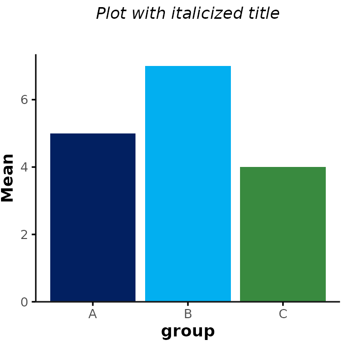
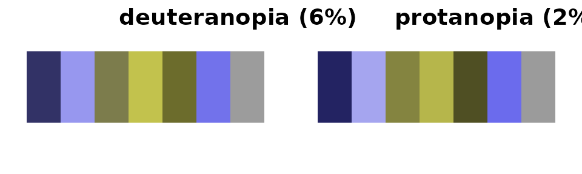
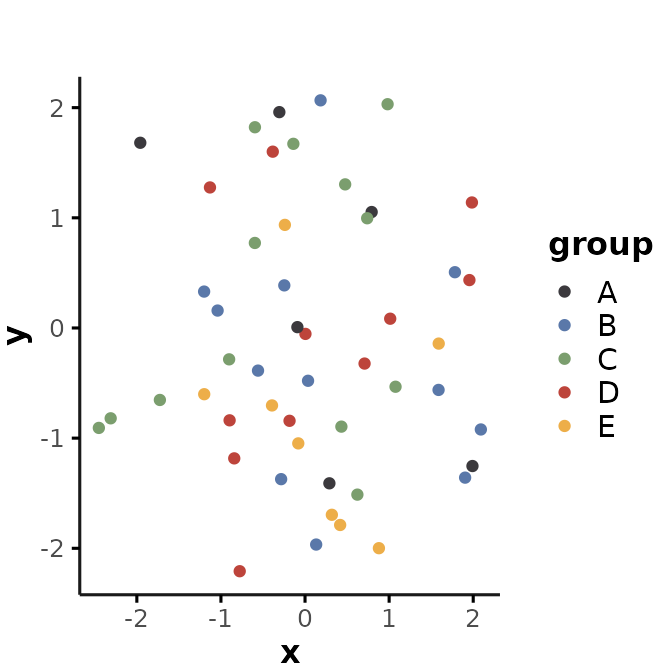
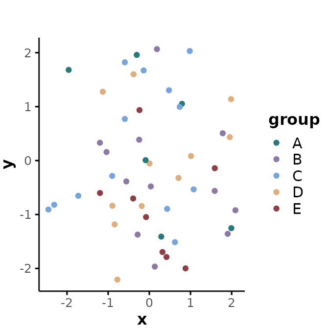
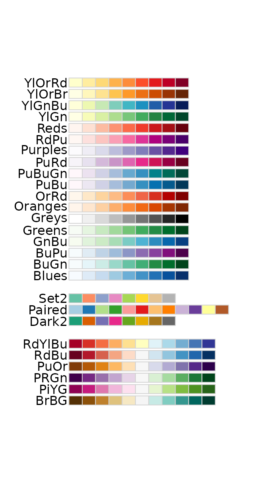

# Plotting Functions - Themes & Colors

------------------------------------------------------------------------

## Introduction

This vignette introduces a standardized plotting theme
([*plot_theme()*](#plot_theme)) and color palettes
([*gemini_colors()*](#gemini_colors)) that users can apply to any ggplot
figures they create in their analyses. The goal of these functions is to
simplify the process of creating figures with a clean and consistent
look. To create publication-ready figures, we recommend that users apply
additional customization based on their needs (see section
[Resources](#resources)).

------------------------------------------------------------------------

## Theme for `ggplots`

[`Rgemini::plot_theme()`](https://gemini-medicine.github.io/Rgemini/reference/plot_theme.md)
adds a simple theme to any `ggplot` figures. The theme is based on
[`ggthemes::theme_foundation()`](http://jrnold.github.io/ggthemes/reference/theme_foundation.md),
with some additional tweaks, and users can easily adjust the theme as
needed. By default,
[`plot_theme()`](https://gemini-medicine.github.io/Rgemini/reference/plot_theme.md)
is applied to all other plotting functions in `Rgemini` (e.g.,
[`plot_summary()`](https://gemini-medicine.github.io/Rgemini/reference/plot_summary.md)
and
[`plot_over_time()`](https://gemini-medicine.github.io/Rgemini/reference/plot_over_time.md)).

The following example illustrates the theme applied to a basic barplot.
**Note:** `plot_theme` does not change the bar colors, but only the
general plot aesthetics (e.g., background/axes/grid/fonts). However, for
illustration purposes, we also add the default color palette from
[`gemini_colors()`](https://gemini-medicine.github.io/Rgemini/reference/gemini_colors.md)
using `fill` here (see section [Color Palettes](#gemini_colors) for more
details):

``` r
library(Rgemini)
library(ggplot2)

# create example data
my_data <- data.frame(group = c("A", "B", "C"), mean = c(5, 7, 4))

# generate barplot
my_plot <- ggplot(data = my_data, aes(x = group, y = mean, fill = group)) +
  geom_bar(stat = "identity", fill = gemini_colors(1)[1:3]) +
  scale_y_continuous(name = "Mean", expand = expansion(mult = c(0, .05)))

# original ggplot theme
my_plot + ggtitle("Original plot")
```


``` r
my_plot +
  plot_theme() + # add Rgemini plot_theme
  ggtitle("Plot with default GEMINI theme")
```


 

### Additional inputs for `plot_theme()`

[`plot_theme()`](https://gemini-medicine.github.io/Rgemini/reference/plot_theme.md)
accepts inputs specifying the font size/type (which are passed to
[`ggthemes::theme_foundation()`](http://jrnold.github.io/ggthemes/reference/theme_foundation.md)).
Users can also specify whether to show major/minor grid lines. For
example:

``` r
my_plot +
  plot_theme(base_size = 15, base_family = "mono", show_grid = c("major", "minor")) +
  ggtitle("Mono plot with grid lines")
```


 

Additionally,
[`plot_theme()`](https://gemini-medicine.github.io/Rgemini/reference/plot_theme.md)
accepts inputs that can be passed to
[`ggplot2::theme()`](https://ggplot2.tidyverse.org/reference/theme.html),
which allows for further customization (see
[here](https://ggplot2.tidyverse.org/reference/theme.html)). For
example, to change the aspect ratio of the plot and angle of the x-tick
labels:

``` r
my_plot +
  plot_theme(
    aspect.ratio = 1.5,
    axis.text.x = element_text(angle = 45, hjust = 1)
  ) +
  ggtitle("Tall plot with tilted x-tick labels")
```


 

### Overwriting `plot_theme()` settings

If you are specifying inputs for settings that are already defined by
[`plot_theme()`](https://gemini-medicine.github.io/Rgemini/reference/plot_theme.md),
you will see an error message saying that the argument was matched by
multiple inputs. For example,
[`plot_theme()`](https://gemini-medicine.github.io/Rgemini/reference/plot_theme.md)
already specifies default characteristics for `plot.title`
(`face = "bold"`). Thus, if you try to run the following code to
italicize the title, you will see an error message saying:

``` r
my_plot +
  plot_theme(plot.title = element_text(face = "italic")) +
  ggtitle("Plot with additional theme")
```

Error in theme(plot.title = element_text(face = ‘bold’, size = rel(1), :
formal argument ‘plot.title’ matched by multiple actual arguments

 

To avoid this error, you need to add a separate
[`ggplot2::theme()`](https://ggplot2.tidyverse.org/reference/theme.html),
which will overwrite the default characteristics specified by
[`plot_theme()`](https://gemini-medicine.github.io/Rgemini/reference/plot_theme.md):

``` r
my_plot +
  plot_theme() +
  theme(plot.title = element_text(face = "italic")) +
  ggtitle("Plot with italicized title")
```



------------------------------------------------------------------------

## GEMINI Color Palettes

`Rgemini` includes a few custom color palettes that can be applied to
any figures. To view all color palettes, you can run:

``` r
plot_color_palettes()
```


“GEMINI Glow” (palette \#1) is used as the default color palette.

### Colorblind Accessibility

All GEMINI color palettes are designed to be colorblind accessible.
However, within each color palette, certain combinations of colors may
be easier to distinguish than others. If you only need a small subset of
colors, we recommend choosing the ones that are most easily
distinguishable. You can check how colorblind friendly the chosen color
combinations are using the `colorBlindness` R library or this website:
<https://www.color-blindness.com/coblis-color-blindness-simulator/>

For example, this simulates how the colors from the “GEMINI Glow”
palette (#1) would be perceived by a colorblind person:

``` r
library(colorBlindness)

fig <- ggplot(
  data.frame(x = as.factor(seq(7, 1))),
  aes(x = 1, y = 1, fill = x)
) +
  geom_col(position = position_stack(reverse = TRUE), show.legend = FALSE) +
  scale_fill_manual(values = gemini_colors(1)) +
  coord_flip() +
  theme_void() +
  theme(
    aspect.ratio = 0.3,
    plot.title = element_text(hjust = 0)
  )

fig + ggtitle("Original")
```


``` r
colorBlindness::cvdPlot(fig, layout = c("deuteranope", "protanope"))
```



### Selecting GEMINI palettes/individual colors

All hex values for an individual palette can be obtained by running
[`gemini_colors()`](https://gemini-medicine.github.io/Rgemini/reference/gemini_colors.md)
with a numeric input (e.g., `gemini_colors(2)` for “Shadowed Spectrum”)
or character input that matches the starting character(s) of a given
palette (e.g., `gemini_colors("S")` for “Shadowed Spectrum”).

For example:

``` r
set.seed(2)
data <- data.frame(
  x = rnorm(50),
  y = rnorm(50),
  group = sample(c("A", "B", "C", "D", "E"), 50, replace = TRUE)
)

ggplot(data, aes(x = x, y = y, color = group)) +
  geom_point() +
  plot_theme() +
  scale_color_manual(values = gemini_colors(2)) # = gemini_colors("S")
```



 

This approach works for figures generated with any R package.

 

### Applying GEMINI colors to `ggplots`

For figures created with `ggplot2`, you can also use
[`scale_fill_gemini()`](https://gemini-medicine.github.io/Rgemini/reference/scale_fill_gemini.md)
or
[`scale_color_gemini()`](https://gemini-medicine.github.io/Rgemini/reference/scale_color_gemini.md)
to apply the color palettes. For example:

``` r
ggplot(data, aes(x = x, y = y, color = group)) +
  geom_point() +
  plot_theme() +
  scale_color_gemini(4) # = gemini_colors("L")
```



 

### Color palettes from other packages

In addition to the GEMINI color palettes, there are several other
packages that create beautiful color palettes for publication-ready
figures. Below is a short intro on some of the colorblind friendly
options we recommend using. These palettes allow for additional
flexibility and customization that is currently not supported by the
GEMINI color palettes.

#### `viridis`

The viridis color palettes are a set of perceptually uniform color maps
designed for scientific visualization. They were developed to address
limitations of traditional color maps, which often suffer from uneven
brightness or discontinuities in hue. For more details, see
[here](https://cran.r-project.org/web/packages/viridis/vignettes/intro-to-viridis.html)

For example, this is a selection of 7 colors from the **“Viridis”**
palette:

``` r
library(viridis)
fig + scale_fill_viridis(discrete = TRUE, option = "viridis")
```


 

… or viridis’ **“Magma”** palette:

``` r
fig + scale_fill_viridis(discrete = TRUE, option = "magma")
```


 

#### `ggsci`

The `ggsci` package provides a collection of color palettes specifically
designed for scientific journals. These color palettes are designed to
enhance the visual appeal and interpretability of ggplot2 graphics. For
more details, see
[here](https://cran.r-project.org/web/packages/ggsci/vignettes/ggsci.html%20and%20https://nanx.me/ggsci/articles/ggsci.html).

Some examples of commonly used `ggsci` palettes include:

**JAMA palette:**

``` r
library(ggsci)
fig + scale_fill_jama()
```


**Lancet palette:**

``` r
fig + scale_fill_lancet()
```


**JCO palette:**

``` r
fig + scale_fill_jco()
```


 

#### `RColorBrewer`

ColorBrewer is a flexible tool for selecting color schemes. ColorBrewer
includes color palettes that are colorblind safe, print friendly, and
perceptually uniform. It offers a wide range of colors optimized for
different types of data and visualization purposes. For more details,
see [here](https://colorbrewer2.org/#type=sequential&scheme=BuGn&n=3).

For example, this illustrates the **“PRGn” palette**:

``` r
library(RColorBrewer)
fig + scale_fill_brewer(palette = "PRGn")
```


 

You can explore all colorblind friendly ColorBrewer palettes by running:

``` r
display.brewer.all(colorblindFriendly = TRUE)
```



------------------------------------------------------------------------

## Resources

- ggplot2 vignette for theme specifications:
  <https://ggplot2.tidyverse.org/reference/theme.html>
- a comprehensive guide on ggplot2 & color palettes:
  <https://www.cedricscherer.com/2019/08/05/a-ggplot2-tutorial-for-beautiful-plotting-in-r/>
- ggsci color palettes for scientific journals:
  <https://cran.r-project.org/web/packages/ggsci/vignettes/ggsci.html>
  and <https://nanx.me/ggsci/articles/ggsci.html>
- viridis color maps:
  <https://cran.r-project.org/web/packages/viridis/vignettes/intro-to-viridis.html>
- color brewer:
  <https://colorbrewer2.org/#type=sequential&scheme=BuGn&n=3>
