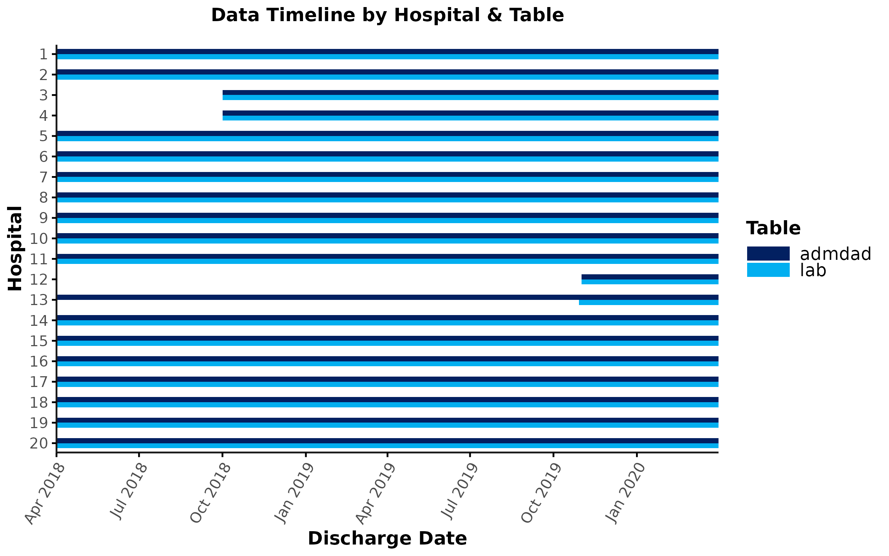
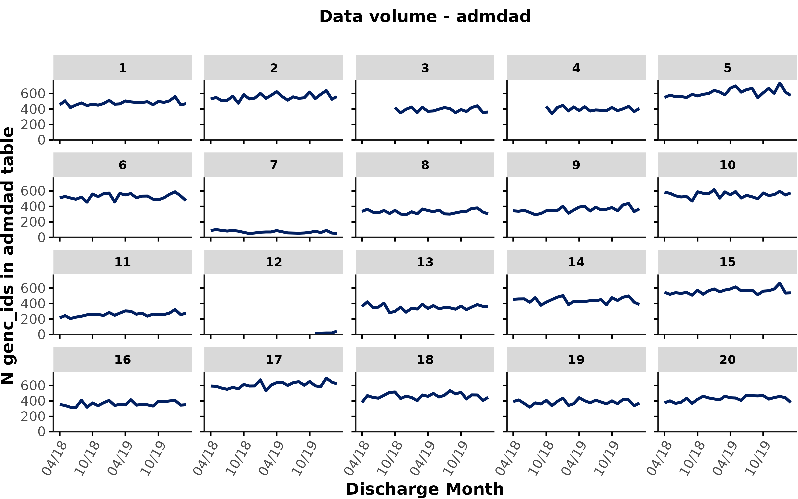
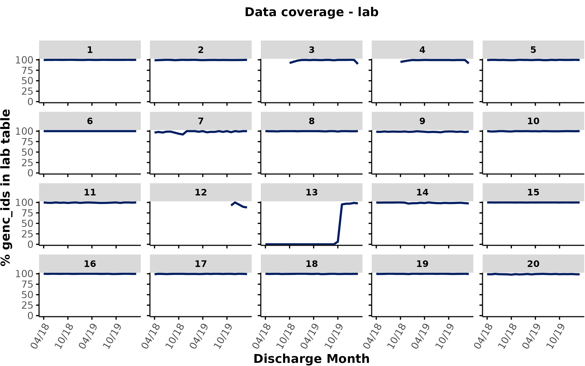

```{r include = FALSE}

knitr::opts_chunk$set(
  collapse = TRUE,
  comment = "#>",
  fig.width = 7,
  fig.height = 5,
  warning = FALSE,
  message = FALSE,
  out.width = "75%"
)

library(data.table)
library(dplyr)
library(Rgemini)
library(lubridate)
library(kableExtra)
library(ggplot2)

#library(DBI)
#library(getPass)
#library(RPostgreSQL)
# library(tidyverse)


#rmarkdown::render("~/GitHub/Rgemini/vignettes/stats_intro.Rmd", output_dir = "/mnt/nfs/projects/research_projects/Rgemini/stats_vignette/")

#setwd("~/GitHub/Rgemini/vignettes/")

```


*  *  *  *


# Introduction & overview

This vignette illustrates an example analysis with (dummy) GEMINI data. The goal of this vignette is to provide an educational resource for analysts to make informed decisions at each analysis step. Throughout the vignette, we also provide links to existing resources with more detailed explanations.

If you would like to discuss any topics in more detail, please use the [Rgemini discussion forum](https://github.com/GEMINI-Medicine/Rgemini/discussions/categories/statistics).


*  *  *  *

# Research question & conceptual model 

In this tutorial, we will consider a hypothetical research study to investigate the question:

> **What is the effect of patients' age on clinical outcomes (in-hospital mortality, length of stay (LOS)), among patients with pneumonia discharged between 2018 - 2020?**. 


## Study design

As a general first step in conducting a research study, researchers would carefully consider the study design most suitable for answering the research question. Although analysts typically do not come up the study design themselves, knowing the fundamentals of study designs would help in effective understanding of research proposals and communicating with PIs and other researchers. 

<br></br>
<details>
<summary>**Expand section to learn about study designs and data considerations**</summary>

- The choice of study design is critical as it sets the framework for conducting the research, directs the analysis method, and influences robustness and validity of the study findings. For example, a cohort study provides stronger evidence for causal relationships than a case-control study. 

- Below is a brief sketch of the core designs in clinical research. Check out these resources for a refresher on core study designs: [1](https://www.ncbi.nlm.nih.gov/books/NBK470342/), [2](https://doi.org/10.1016/S0140-6736(02)07283-5). Of note, although there are general core study designs, designs and their categorizations are not rigid, and there are more complex designs and grey areas that may not clearly distinguish one design from another.

```{r, echo=FALSE, out.width = "40%", fig.align = "center", fig.cap="<span style='color:grey; font-size:11px'> Figure 1. Common Study Designs. ([Grimes DA and Schulz KF. The Lancet, 2002](https://doi.org/10.1016/S0140-6736(02)07283-5)) </span> " }
knitr::include_graphics("figures/stats_intro/study_design.png", dpi = 200)
```


- Clearly, the choice of study design is dependent on the nature of the data being used. 

  + In experimental studies, data collection is driven by specific research questions (researchers have control over participant recruitment, intervention assignment and measurements collection). 
  + In contrast, GEMINI data are sourced from **routine data** collected on the basis of hospital admissions primarily for administrative and clinical purposes, not tailored to answering any specific research question. 
  
  > <span style='font-size:12px'> **Routine data**: A major source of GEMINI data is routinely collected electronic health records (EHR). Thus, our data shares similar characteristics and considerations as other EHR-derived databases when conducting research. This topic is beyond the scope of this tutorial. You are encouraged to check out these review articles [1](https://www.ncbi.nlm.nih.gov/pmc/articles/PMC6724703/), [2](https://pubmed.ncbi.nlm.nih.gov/38273982/), [3](https://dcricollab.dcri.duke.edu/sites/NIHKR/KR/Acquiring%20and%20Using%20Electronic%20Health%20Record%20Data.pdf) for a general overview of using EHR-derived data for research (e.g. common terminology, data attributes, study designs, advantages and limitations. Note that these articles were written in a US setting but the discussed concepts are generally applicable). </span>

  + The nature of routine data makes GEMINI data particularly suitable for conducting **observational studies**. Below are some example observational studies conducted using GEMINI data:
    + Retrospective cohort: <span style='font-size:11px'> [Bai AD et al. CHEST, 2024](https://doi.org/10.1016/j.chest.2023.08.008). [McIntyre MT et al. CMAJ, 2023](https://doi.org/10.1503/cmaj.221732). [Doshi S et al. JAMA Intern Med., 2023](https://doi.org/10.1001/jamainternmed.2023.2629).</span>
    + Cross-sectional: <span style='font-size:11px'>[Razak F et al. CMAJ Open, 2020](https://doi.org/10.9778/cmajo.20200098), [Verma AA et al. CMAJ Open, 2019](https://doi.org/10.9778/cmajo.20180181)</span>
    + Other designs are possible, see [GEMINI publications](https://geminimedicine.ca/publications/)

</details>
<br></br>

With knowledge about study designs and GEMINI data characteristics, let’s determine which study design would be suitable for addressing our research question.

- The exposure of interest is patient's age at admission. The outcomes of interest are in-hospital mortality and LOS.

- Experimental studies are not possible for this question (impossible for researchers to manipulate the exposure variable, age). The question is **observational** by nature, which is well suited for using GEMINI data.

- The question is looking to estimate the association (magnitude and direction) between patients' age at admission and their clinical outcomes. An analytical study rather than a descriptive study is required. Since in-hospital mortality and LOS can only be known after hospital admission, the temporal relationship between exposure and outcome is implied. Therefore, our research question calls for a **cohort study design**, which means that researchers would assemble a cohort of patients based on characteristics at admission (e.g. pneumonia) and then follow them over time for the occurrence of outcomes.

- As the outcomes of interest have already occurred upon data extraction, the cohort is considered retrospective.

- Therefore, a **retrospective cohort study** would be suitable for addressing the research question.


*  *  *  *

# Conceptualizing the Research Question

## Directed Acyclic Graphs
A visual, conceptual model can help understand the research question and how its components are related to one another. A directed acyclic graph (DAG) is a graphical representation of the relationship between the outcome, exposure, and related variables: [Digitale JC et al. J Clin Epidemiol, 2022](https://www.ncbi.nlm.nih.gov/pmc/articles/PMC8821727/). It can be helpful in picking a statistical model by 'drawing' out the assumptions between variables. The following DAG shows a simple theoretical causal relationship between age, the exposure variable, and in-hospital mortality, one of the outcomes of interest. 

```{r, echo=FALSE, out.width = "60%", fig.align = "center", fig.cap="<span style='color:grey; font-size:11px'> DAG of age and in-hospital mortality</span> " }
knitr::include_graphics("figures/stats_intro/dag_img1.png", dpi = 200)
```

<br></br>
<details>
<summary>**Expand section to learn more about DAGs**</summary>
- In a DAG, causal relationships are always unidirectional (i.e. age can be a cause of in-hospital mortality, but not the reverse). Two causal relationships following each other form a path.
- There are common ways of describing the relationship between nodes (i.e. variables): 1) parent and children (direct relationship), 2) descendants and ancestors (any node along the path to or from another node)
- A directed path describes a causal relationship between two nodes
- An indirect path describes a confounding relationship between two nodes
- For more information, check out these resources: [DAGs: A simple introduction with simulations in R](https://arelbundock.com/posts/acmq_en_06_dag/), [Applications of DAGs in Causal Inference](https://www.r-bloggers.com/2018/08/applications-of-dags-in-causal-inference/)
</details>

## Third Variables
While it is possible to estimate the effect of age on mortality on its own, often called an unadjusted model, it is common practice to control for variables that could have a direct or indirect cause on the exposure and outcome. These variables are called confounders (also referred to as covariates) and controlling for these variables debiases the association between the variables of interest: [Wysocki A et al. Adv Meth Pract Pyschol Sci, 2022](https://journals.sagepub.com/doi/10.1177/25152459221095823#:~:text=After%20outlining%20a%20causal%20structure,of%20the%20predictor%20and%20outcome). 

  - Gender can affect the age that one acquires pneumonia, along with the severity of illness            experienced when pneumonia is acquired: [Corica B et at. Intern   Emerg Med, 2022](https://www.ncbi.nlm.nih.gov/pmc/articles/PMC9294783/).
  - Charlson comorbidities are comorbid conditions that can be used to predict the risk of death and     should be controlled for when considering the outcome of death: [Charlson ME et al. J Chronic Dis, 1987](https://www.sciencedirect.com/science/article/abs/pii/0021968187901718).
  - mLAPS (modified laboratory acute physiology score) is an indicator of illness severity based on physiological lab data at or before admission that is used to adjust for risk: [Roberts S et al. Preprint, 2023](https://www.medrxiv.org/content/10.1101/2023.01.06.23284273v1). GEMINI's in-house package `Rgemini` contains an [`mlaps()` function](https://github.com/GEMINI-Medicine/Rgemini/blob/main/R/mlaps.R) with additional documentation on how mLAPS is derived.

Including additional variables in a statistical model is referred to as an adjusted model and can help better understand the causal relationship between an exposure and its outcome. The DAG below takes these variables into account. 
```{r, echo=FALSE, out.width = "60%", fig.align = "center", fig.cap="<span style='color:grey; font-size:11px'> DAG of age and in-hospital mortality, including confounders </span> " }
knitr::include_graphics("figures/stats_intro/dag_img2.png", dpi = 200)
```

Confounders are not the only variables that can affect the relationship between age and in-hospital mortality or LOS. Mediators, or intermediate variables, lie in the causal pathway between the exposure variable and outcome. In this analysis, a mediator would be caused by age and is a cause of the outcome variables. This type of analysis, mediation analysis, is beyond the scope of this vignette, but it is important to understand the distinction between controlling for a confounder that could bias results, and including mediators that block the path to an outcome: [MacKinnon D. Res Soc Work Pract, 2011](https://www.ncbi.nlm.nih.gov/pmc/articles/PMC3366634/)


## Cohort definition

### GEMINI cohort

GEMINI data include all patients admitted to the department of medicine or an intensive care unit. A lot of GEMINI projects focus on a subset of the medicine cohort: Patients admitted to/discharged from General Internal Medicine (GIM). GIM is the biggest medicine department and exists at all hospitals participating in GEMINI. A large portion (~40%) of emergency admissions are admitted to GIM. The GIM cohort is very heterogenous (unlike patients admitted to other medicine subservices that specialize in cardiology, nephrology, neurology etc.). GIM patients tend to have complex, multimorbid conditions making this cohort of particular interest when studying the effect of patient characteristics on clinical outcomes. 

### Study cohort

Based on the conceptual model discussed above, we will define our study cohort as follows:

+ **Inclusion steps**
  - Incl. 1: All GIM encounters discharged between Apr 2018 - Apr 2020
  - Incl. 2: Encounters with high lab data coverage (required for `mlaps`)
  - Incl. 3: Encounters with Pneumonia as most responsible diagnosis code (MRDx)

+ **Exclusion steps:**
  - Excl. 1: Encounters transferred from another acute-care institute 
  - Excl. 2: Encounters not admitted from ED
  
The reason for the two exclusion steps is to make sure that any covariates we include as baseline characteristics (e.g., `mlaps` at admission) accurately reflect patients' condition when they first entered the hospital (rather than having received prior treatment at another healthcare facility they were transferred from).


<details>
<summary>***Expand this section for some additional tips***</summary>

The cohort inclusion/exclusion steps should be developed in close collaboration between the clinical researcher and data analyst. Typically, the steps will need to be refined during the project kick-off meeting to make sure the specific criteria, sequence, and rationale for the cohort definition makes sense. The cohort creation steps may also need to be refined once the analyst has completed the data checks (see next section), which might reveal unforeseen challenges, such as data coverage/quality issues.

</details>


*  *  *  *

# Data checks & cohort generation

Now that we have clarified the conceptual framework and cohort definition, let's take a look at the data.

Here, we assume our cohort consists of all GIM encounters discharged between Apr 2018 - Apr 2020 (see incl. 1 above) from 20 hospitals. GIM encounters are defined as all encounters that were either admitted to/or discharged from GIM (see `gim_flag_derived` in the `derived_variables` table).

We'll load this dummy data from a saved file and turn it into a `data.table` object:

```{r}
# read sample data
data <- readRDS("/mnt/nfs/projects/research_projects/Rgemini/stats_vignette/dummy_data_stats.rds") %>%
  data.table()
```

To briefly inspect the variables in our data table, we can use `head():`

```{r}
head(data)
```

You can also use `summary()` or `Hmisc::describe()` to gather quick insights into the variables in this dataset.

Additionally, the [GEMINI data dictionary](https://geminimedicine.ca/the-gemini-database/) contains more information about all data elements in the GEMINI database.


<br></br>

Next, we will perform data quality/coverage checks and create our cohort. **The steps in the sections below are not strictly sequential!** Instead, data checks and cohort refinement typically go hand in hand based on an iterative process: We usually start with some basic data checks & exploration on the whole dataset, then apply cohort inclusion/exclusion steps, then check the data for cohort-specific issues, which may cause us to refine your inclusions/exclusions etc. ... Throughout this process, we may also derive additional variables, which should be included in the data checks to make sure all variables in the final cohort are ready to be analyzed.


## Check data coverage

To answer our research question, we rely on data elements from the `admdad` table (containing administrative data like patient age and sex) and the `lab` table (containing all laboratory tests that are relevant for `mLAPS`). We should therefore carefully check data coverage for both of these tables to a) gain more detailed insights into which hospitals & time periods contribute to our analyses and b) select encounters with high data coverage for our cohort (see cohort inclusion 2 mentioned above).

Please carefully review the **`Rgemini::data_coverage()` function and [data coverage vignette](https://github.com/GEMINI-Medicine/Rgemini/blob/139_data_coverage/vignettes/data_coverage.Rmd)** for more details.

<strong style="color:red;">Here is a brief summary of important coverage considerations: </strong>

+ By definition, all GEMINI encounters exist in the `admdad` table. However, patient volume (overall number of encounters) and the min-max dates of `admdad` coverage may vary across hospitals.
+ **Clinical variables** (such as `lab` data) may only have partial data coverage, even when administrative data are fully available. This is due to challenges associated with extraction of clinical data, which can lead to gaps/unexpected drops in data coverage.
+ It is crucial to always check data coverage for **all relevant tables** and make an informed decision on how to handle time periods/hospitals with data coverage issues in the analyses. If relevant, report differences in coverage periods between hospitals in your manuscript.
+ In general, data coverage checks should be performed on **all encounters** from hospitals and time periods of interest (e.g., data from Apr 2018-2020 from 20 hospitals), before applying study-specific cohort inclusions/exclusions (e.g., based on diagnosis criteria).
+ Typically, we recommend checking data coverage by hospital \* **discharge month** because GEMINI data are pulled based on patients' discharge dates. For clinical variables, you may also want to plot coverage by the relevant clinical date-time variable (e.g., `collection_date_time` for lab data). 

In our case, we can run the `data_coverage()` function to check coverage for `admdad` and `lab` as follows:

```{r eval = FALSE}
coverage <- data_coverage(
  dbcon = dbcon, # connection to GEMINI database
  cohort = data, # all GIM encounters from relevant hospitals/time periods
  table = c("admdad", "lab") # data tables relevant for analyses
)
```

The `data_coverage()` function queries the `lookup_data_coverage` table, which lists the min-max dates with coverage for each data table and hospital (also see Data Availability plot in the [Data Dictionary](https://geminimedicine.ca/the-gemini-database/)). According to this table, a **gap in data coverage is defined as a period of >28 days without any data**. In other words, this lookup table only provides a very rough check of whether GEMINI received **any** data (at least 1 `genc_id`) from a given hospital during a certain time period.

The `data_coverage()` function facilitates coverage checks by returning multiple plots:

### Timeline plot

The timeline plot illustrates the min-max discharge dates listed in the `lookup_data_coverage` table. This allows users to get a general overview of the table \* hospital combinations for which GEMINI data have **any** coverage (at least 1 `genc_id`):

```{r echo = FALSE}

```


<details>
<summary>**Let's inspect the timeline plot. What should you look out for?**</summary>

+ **Between-hospital differences in data timelines**
  + Looking at the timelines for `admdad`, you’ll notice that some hospitals may have later start dates (e.g., hospitals 3, 4, and 12) and/or earlier end dates compared to other hospitals. If you are specifically interested in time trends or think that your analyses could be biased by changes over time, you may need to a) explicitly account for differences in timelines, b) restrict your analyses to time periods that overlap across all sites, or c) exclude sites with limited data timelines. Similarly, if you aim to analyse differences between hospitals, make sure that any between-hospital differences are not driven by differences in timelines. 
+ **Within-hospital differences in data timelines**
  + Even within the same hospital, data timelines can vary between tables. For example, at site 13, `lab` data coverage only starts in November 2019 even though `admdad` data are covered throughout all of 2018-2020. This is typically due to challenges associated with extracting clinical (as opposed to administrative) data. Since we will only include encounters that have coverage for *both* `admdad` and `lab` data, keep in mind that our effective data timeline for site 13 is Nov 2019 - April 2020.
+ **Other coverage issues**
  + Although this isn't the case here, you may also observe interrupted timelines (i.e., gaps in data coverage) or scenarios where some hospitals don't have any data coverage at all for a given table of interest. Please carefully review the [data coverage vignette](https://github.com/GEMINI-Medicine/Rgemini/blob/139_data_coverage/vignettes/data_coverage.Rmd) for further examples and a more detailed discussion on these issues.
</details>

<br></br>

### Coverage plots

As mentioned above, the current definition for "data coverage" in the timeline plot only requires a single `genc_id` with an entry in the `admdad`/`lab` table during a given time period. We therefore recommend performing additional, more granular checks of coverage. The `data_coverage()` function returns additional coverage plots to faciliate these checks: 

**a) `admdad` volume**

For the `admdad` table, the function returns the raw count of `genc_ids` by hospital and discharge month to indicate overall patient volume: 

```{r echo = FALSE}

```

<details>
<summary>**Let's inspect the `admdad` volume plot. What should you look out for?**</summary>

**1) Data timeline periods:** As we already saw in the timeline plot above, hospitals 3, 4, and 12 do not have any encounters in `admdad` during earlier time periods (shown as `NA` in the coverage plot).

**2) Patient volume at each hospital:** Some hospitals have a smaller number of encounters overall (e.g., sites 7, 11, & 12) compared to others (e.g., sites 5 & 17). This means that some sites will contribute fewer data points to our analyses than others (e.g., small community hospitals vs. large academic hospitals). GEMINI also includes some hospitals that provide specialized care, with only a small subset of encounters being considered GIM. You can find more information about each hospital in the `lookup_hospital` table as well as the `additional_info` column in the `lookup_data_coverage` table. This can help you determine how to handle these sites in your analyses.

**3) Changes in patient volume over time:** Although this isn't the case here, you might observe sudden drops/increases in encounter numbers over time. This might be due to seasonal changes, COVID-related factors, changes in the GEMINI cohort definition (e.g., expansion from GIM to all-medicine), or potential biases introduced during cohort inclusion/exclusion steps (see below). 
</details>

<br></br>

**b) `lab` coverage**

For all other tables (other than `admdad`), `data_coverage()` returns a plot showing the % (instead of raw count) of `genc_ids` with an entry in a given data table by hospital \* discharge month.

```{r echo = FALSE}

```

As we already showed in the timeline plot above, site 13 does not have any lab data prior to November 2019 although `admdad` data are available. As a result, lab data coverage is 0% for earlier time periods (i.e., we will exclude these encounters from our analyses).

**For any hospitals/time periods with coverage >0%, how would you define "good" data coverage?**

<details>
<summary>**Expand this section for some tips**</summary>

The expected % of `genc_ids` with an entry in a given table depends on the clinical context. For example, we would expect the vast majority of GIM encounters to receive at least 1 lab test. As a result, >95% of `genc_ids` should have an entry in the lab table, and this should be fairly stable over time and across sites. By contrast, let's say we are looking at data coverage for transfusion or radiology data: Only a small proportion of GIM encounters receive a transfusion or radiology test during their hospitalization, and transfusion/imaging practices can vary across sites. Similarly, if you look at data coverage for ICU (`ipscu` table), keep in mind that some hospitals don't have an ICU. Thus, you need to evaluate the coverage plots with the relevant clinical context in mind, and typically, there is no single coverage threshold that can be applied across all tables/hospitals. Instead, we recommend the following:

- Discuss with an SME what % of patients they would expect to receive a lab test/transfusion/etc.
- Check the `lookup_hospital` table and the `additional_info` column in the `lookup_data_coverage` table to check for any relevant information that may explain differences in coverage between hospitals (e.g., hospital provides specialized care, doesn't have an ICU etc.). 
- Look out for sudden drops in data coverage *within* a given hospital. This might indicate a coverage issue due to data extraction challenges. Please flag these issues to the GEMINI team.

</details>

<br></br>

### Encounter-level flags

Finally, the `data_coverage()` function returns a flag for each `genc_id` in `data` indicating whether a given encounter was discharged during a time period/from a hospital with *any* `admdad`/`lab` coverage (based on the min-max dates listed in the `lookup_data_coverage` table). This does *not* mean that all `genc_ids` where the flag is `TRUE` have an entry in the lab table. Instead, the coverage flag being `TRUE` only tells us that there were *some* encounters during the same discharge period that had an entry in the `lab` table. This is  valuable information that can help us determine how to handle `genc_ids` that **do not** have an entry in the lab table (i.e., `genc_ids` with missing `mLAPS` - see below):

+ **If the coverage flag is `TRUE` and the additional coverage plots did not reveal any issues (e.g., sudden drops in `lab` data coverage):** We can now infer that if an encounter indeed received a lab test, it should be reflected in the `lab` table (since coverage is consistently high). Conversely, if a `genc_id` does not exist in the `lab` table (even though the coverage flag is `TRUE`), we can assume that the encounter did not receive a lab test - for example, because testing may not have been clinically indicated.

+ **If the coverage flag is `FALSE` or if we identified any issues in the coverage plots above:** This means that if a `genc_id` does not exist in the `lab` table, we don't have sufficient information to determine whether a) the encounter did in fact not receive a lab test (true negative) or b) whether the encounter received a lab test but the test is not captured by GEMINI data due to coverage issues (false negative).

In our case, we did not observe any lab data coverage issues (beyond periods without any lab data at all), so we can go ahead and filter for `genc_ids` where the flags returned by `data_coverage()` are `TRUE`. This will exclude any encounters that were discharged during time periods where GEMINI did not receive any lab data at all.

For example, here are some (dummy) encounters from site 13 with the corresponding coverage flags for `admdad` and `lab`:

```{r echo = FALSE}
data.table(
  genc_id = c(1, 2, 3, 4, 5),
  hospital_num = c(13, 13, 13, 13, 13),
  discharge_date = c("2018-05-25", "2019-02-10", "2019-09-18", "2019-12-05", "2020-03-12"),
  admdad = rep(TRUE, 5),
  lab = c(FALSE, FALSE, FALSE, TRUE, TRUE)
) %>% knitr::kable(format = "html")
```

```{r echo = FALSE}
coverage <- data.table(
  hospital_num = data$hospital_num,
  genc_id = data$genc_id,
  discharge_date = as.Date(data$discharge_date_time)
)
coverage[, lab := TRUE]
coverage[hospital_num == 13 & discharge_date < "2019-11-01", lab := FALSE]
```

## Apply cohort inclusions/exclusions

Once we checked coverage on the whole dataset, we can filter for the relevant encounters based on the inclusion/exclusion steps listed above. The `Rgemini` package contains a `cohort_creation()` function to facilitate this process. 

Briefly, this is how you would use the function:
```{r}
# the function doesn't exist on the main branch yet, so pull from branch 142 in the meantime
source("../R/cohort_creation.R")

cohort_table <- cohort_creation(
  cohort = list(
    data, # all GIM encounters between 2018-2020
    data[genc_id %in% coverage[lab == TRUE]$genc_id], # lab coverage
    data[grepl("^J1[2-8]", ipdiagnosis_mrdx)], # Pneumonia MRDx
    data[acute_transfer_in == TRUE], # acute care transfer
    data[admitted_from_er == FALSE] # ED admission
  ),
  labels = c(
    "All GIM encounters discharged between Apr 2018 - Apr 2020",
    "Encounters with lab data coverage",
    "Encounters with Pneumonia as MRDx",
    "Encounters transferred from another acute-care institute",
    "Encounters not admitted from ED"
  ),
  exclusion_flag = c(FALSE, FALSE, FALSE, TRUE, TRUE) 
)
```

The function returns a list with 2 items:

1) A `data.table` object containing all rows from the original `data` table that are included in the final cohort (N = 8,515, based on all inclusions/exclusions). We will name this table `cohort`, which will be used in all subsequent analyses below:

```{r}
cohort <- cohort_table[[1]]

head(cohort) %>%
  knitr::kable(escape = FALSE, format = "html")
```

2) A table showing the number (%) of encounters that were included/excluded at each cohort creation step:

```{r}
cohort_table[[2]] %>%
  knitr::kable(escape = FALSE, format = "html")
```

Let's go through each cohort creation step in a bit more detail and discuss the decisions the analyst had to make to build the cohort correctly. 

**1) Incl. 1: GIM encounters discharged between April 2018-2020**

- This is our baseline cohort that includes all encounters in `data`.
- As a reminder, the `derived_variables` table contains a `gim` flag, which is `TRUE` for all encounters that were admitted to/discharged from a GIM service.

**2) Incl. 2: Encounters with lab data coverage**

- Here, we include all encounters where the `lab` coverage flag returned by the `data_coverage()` function is `TRUE`. If you spotted any coverage issues and wanted to exclude any other hospitals/time periods, you could apply additional criteria here or run the `data_coverage()` function [with customized dates](https://github.com/GEMINI-Medicine/Rgemini/blob/139_data_coverage/vignettes/data_coverage.Rmd). Note: by definition, the `admdad` coverage flag is always `TRUE` for all encounters, so we do not need to apply any inclusions for that.

**3) Incl. 3: Pneumonia diagnosis**

- Here, we filter for entries where `ipdiagnosis_mrdx` (most responsible discharge diagnosis from inpatient diagnosis table) starts with J10-J18 ("Pneumonia").

<details>
<summary>**Expand this section for additional considerations when filtering by diagnosis codes**</summary>

**a) What diagnosis codes to include/exclude?** 
This is usually determined by an SME who will provide you with a list of relevant ICD-10-CA codes. In our example, all ICD-10-CA codes from J10-J18 should be included for pneumonia. Usually, you should filter for all diagnosis codes that **start** with the same characters (i.e., including children codes like "J12.8"), unless otherwise specified. If you are unsure, please clarify with the SME. 

**b) Is the diagnosis type relevant?** 
In our example, the cohort definition specifies "Pneumonia as a most responsible diagnosis code (MRDx)". We therefore need to filter by `diagnosis_type = M`. According to (HSMR methodology)[https://www.cihi.ca/sites/default/files/document/hospital-standardized-mortality-ratio-meth-notes-en.pdf] `diagnosis_type = 6` (Proxy MRDx) should also be included and takes priority over type-M.

**c) Do you only want to filter by in-patient diagnosis codes or also include ED diagnoses?**  
When filtering for a specific condition based on patient's MRDx, we typically only include in-patient diagnoses as they tend to be more reliable compared to ED diagnoses. However, this decision may be project specific, and in certain cases it might make sense to consider ED diagnoses to increase sensitivity. If you are unsure, please discuss this with the SME. 

**d) Can you use CCSR instead of ICD-10-CA codes?**
CCSR (Clinical Classifications Software Refined) groups ICD-10-CA diagnosis codes into cleanically meaningful categories. This can be useful if you are analyzing a large, heterogenous cohort of patients and want to group them for descriptive purposes or to perform risk adjustment by diagnosis group (see [here](https://gemini-medicine.github.io/Rgemini/articles/icd_to_ccsr.html) for more details). However, if your analysis is focused on a single, well-defined diagnosis of interest (e.g., pneumonia in our case), we typically recommend using ICD-10-CA codes to select the specific diagnoses that should be included/excluded. 
</details>

<br></br>

**4) Excl. 1: Acute-care transfer in**

- In our dummy `data` table, this is defined by `acute_transfer_in`, which is derived based on whether the `genc_id` has an entry in `lookup_transfers` where `institution_from_type_mns = AT`. "AT" are acute care institutions that were mapped by GEMINI based on the raw `insitution_from` codes in `admdad`.
- Here, we want to *exclude* encounters where `acute_transfer_in = TRUE` so we will set the `exclusion_flag` to `TRUE` for this step. The function will then automatically show the number (%) of encounters that were *removed* based on this criterion. Depending on your preference, you could also rephrase this as an inclusion step to include all `genc_ids` where `acute_transfer_in = FALSE`.

**5) Excl. 2: Not admitted from ED**

- In our dummy `data` table, `admitted_from_er` indicates if an encounter was admitted from the ED, based on whether a given `genc_id` has an entry in the `er` table.
- Here, we want to *exclude* any encounters that were *not* admitted from the ED, so we can specify `admitted_from_er = FALSE` and `exclusion_flag = TRUE`

<br></br>

## Check variable distributions & missingness in cohort

Now that we have created the cohort, we should plot some basic descriptive statistics to check the distribution & missingness of all relevant predictors/covariates and outcome variables. You can use `Rgemini::plot_summary()` to achieve this:

```{r}
Rgemini::plot_summary(
  cohort[, .(
    age, gender, mlaps, admit_charlson_derived,
    los_days_derived, in_hospital_mortality_derived
  )]
)
```

<br></br>

<details>
<summary>***Please review this plot carefully and think about what information you can gather from it. Then expand this section for more information.***</summary>

By plotting histograms/bar plots of all relevant cohort variables, we can gain insights into the following:

**1) % of entries with missing values:** In our dummy data, only `mlaps` has missing values (see section *4.3.1 Missing values*](#missing) for more details).

**2) Whether the variables are of the expected type (e.g., categorical vs. continuous):** For example, gender in CIHI data largely reflects biological sex, which is treated as a categorical variables with 3 levels (M/F/O).

**3) Whether continuous variables are within the expected range:** For example, in our case, all continuous variables should have values >= 0 (or >= 18 in the case of age) and Charlson Comorbidity Index should be an integer between 0-24. Length of stay has some extreme values (e.g., >365 days). Although these are not implausible (patients can be hospitalized for very long periods of time), we should carefully consider if these patients are part of our patient population of interest (see section *4.3.2 Considering extreme values*](#extreme)).

**4) Whether continuous variables are normally distributed or skewed:** For example, length of stay is heavily right-skewed, which we should consider in our modelling decisions later on (see ***Regression model*** section below).


</details>

In the sections below, we will discuss missing values and outliers in more detail. 


### Missing values {#missing}

Let's first take a closer look at missing values. We need to carefully consider what the reason for missing values is in order to make an informed decision about how to deal with them.

<details>
<summary>***Consider what potential reasons could explain missing values in `mlaps`. Then expand this section for more information.***</summary>

`mlaps` is based on laboratory tests collected before a patient's `admission_date_time` (i.e., in the emergency department). `mlaps` values are missing for any `genc_ids` that do not have any ED lab entries for relevant mLAPS tests. This could be due to the following reasons:

**1. The encounter was not admitted via the ED.** These encounters were excluded from our cohort, so this does not apply here.

**2. That hospital does not have lab data available for that encounter.** We already checked lab data coverage above and removed encounters that were discharged from hospitals/during time periods without lab data coverage. For the remaining time periods, `lab` data coverage was consistently high (>95%).

**3. Tests were not performed.** If we can rule out 1) and 2), the reason for why individual `genc_ids` don't have an `mlaps` value is likely because testing was not indicated for these particular encounters (e.g., when the patient was admitted, the physician did not order any tests included in the `mlaps` calculation because they were not deemed clinically necessary). 

</details>

In our case, the main plausible reason for missing `mlaps` is that testing was not indicated for `genc_ids` with missing `mlaps`. We will therefore impute missing `mlaps` with 0 here (i.e., we assume that the encounter likely would have had normal results on all relevant mLAPS tests):

```{r}
cohort[is.na(mlaps), mlaps := 0]
```


**Note that it's important to distinguish between "data coverage" (overall data volume for certain tables) vs. "missing values" (individual entries with `NA` values for certain table columns).** Even when data coverage is generally high, individual entries may still have missing values. For time periods with high data coverage, we can sometimes make certain assumptions about missing values based on the clinical context, allowing us to perform single-value imputation (e.g., imputing all missing `mlaps` values with 0). There are many cases where we cannot make these assumptions. Make sure to discuss how you handle missing values with your PI and Scientific Advisor. 

<details>
<summary>***Expand this section to learn more about different types of missingness.***</summary>

In our scenario, missingness of `mlaps` represents an example of systematic missingness - also referred to as **"missing not at random" (MNAR)**. This means that the missingness is directly related to other predictor variables (e.g., patients' illness severity) and/or outcomes (e.g., in-hospital death). 

In other scenarios, values might be **missing at random (MAR)**. In that case, we should not perform single-value imputation. Instead, we may decide to use a complete-case analyses (i.e., only include encounters without missing values) or performing multiple imputation. See [here](https://onlinecjc.ca/article/S0828-282X(20)31111-9/fulltext#:~:text=Missing%20data%20is%20a%20common,all%20subjects%20in%20the%20sample) for a more detailed discussion on this.

</details>


### Considering extreme values {#extreme}

In the summary plot above, we can see that there are some encounters with extremely long length of stay (LOS). Let's check what percentage of encounters have a length of stay longer than 90 days:

```{r}
100 * sum(cohort$los_days_derived > 90) / nrow(cohort)
```
Only ~0.5% of patients in our cohort stayed in hospital for more than 90 days. These patients are not representative of the typical pneumonia patient we are interested in. There is an element of complexity to their situation that makes them different than the typical pneumonia patients (maybe they are sicker, maybe they lack social supports to be discharged elsewhere, etc.). Further, our baseline covariates like `mlaps` are measured at the time of admission, but for patients with long LOS, several other events may occur throughout their hospitalization, which can affect clinical outcomes (in fact, patients with long LOS may have been admitted with a different condition, but then contracted pneumonia during their hospitalization, which was ultimately coded as their MRDx). 

To remove any bias these outliers might introduce in the model, we will exclude any encounters with long LOS. Here, we choose LOS <= 90 days as a cut-off, but in general, you should discuss the appropriate criterion with a clinical expert. This will be informed by the nature of the research question. 

Let's re-run the `cohort_creation()` function with the updated cohort inclusions/exclusions:
```{r}
cohort_table <- cohort_creation(
  cohort = list(
    data,
    data[genc_id %in% coverage[lab == TRUE]$genc_id],
    data[grepl("^J1[2-8]", ipdiagnosis_mrdx)],
    data[acute_transfer_in == TRUE],
    data[admitted_from_er == FALSE],
    data[los_days_derived > 90] # additional exclusion of extreme LOS
  ),
  labels = c(
    "All GIM encounters discharged between Apr 2018 - Apr 2020",
    "Encounters with lab data coverage",
    "Encounters with Pneumonia as MRDx",
    "Encounters transferred from another acute-care institute",
    "Encounters not admitted from ED",
    "Encounters with LOS > 90 days"
  ),
  exclusion_flag = c(FALSE, FALSE, FALSE, TRUE, TRUE, TRUE)
)

cohort_table[[2]] %>%
  knitr::kable(escape = FALSE, format = "html")
```

Remember to update your `cohort` data table in line with the updated exclusion criteria: 

```{r}
cohort <- cohort_table[[1]]
```


**Note:** We generally do not recommend blindly removing outliers (e.g., based on generic criteria like +/-3 SDs) unless there is a conceptual rationale, or reasons to assume that outliers are implausible values that may reflect data quality issues (e.g., negative LOS that could be due to data entry errors). Instead, you should carefully consider what the potential reason for outliers is and whether they might affect the relationships between your variables of interest (e.g., see DAG above) in order to decide how to handle extreme values. 


### Variable transformation

During cohort generation, you will often need to create new derived variables, or perform additional preprocessing/transformations. For example, as shown in the plot above, `gender` is a categorical variable with 3 levels. Since `gender = "O"` is very rare and low cell counts represent a patient privacy issue, we will dichotomize this into a new variable "Female" vs. "Not female". We will also rename it into `sex_female` since CIHI data largely reflect biological sex, rather than gender: 

```{r}
cohort[, sex_female := gender == "F"]
```


## Final checks: Plot variables over time & by hospital

In the previous steps, we created the cohort and performed some data preprocessing. Let's plot our cohort variables over time (again) to check whether there are any weird time trends that may introduce biases. This is also a good way to double check whether any of our inclusion/exclusion steps may have introduced unexpected patterns in our data.

As an example, we'll just plot `mlaps` here again (but you should perform similar checks for all other relevant predictor/outcome variables). We would expect `mlaps` to remain fairly stable over time (with some noise). Since we already checked for lab data coverage, we would not expect there to be any time periods with a high percentage of missing entries:

```{r}
Rgemini::plot_over_time(cohort, plot_var = "mlaps", func = "mean")
```
  
**Note:** For the purpose of data exploration and data quality checks, it can often be helpful to plot means instead of medians. Because means are more sensitive to outliers than medians (see more details in the following section), it's often easier to detect unexpected trends/outliers when plotting the mean.


*  *  *  *

# Descriptive statistics

- Generate table1 and additional descriptive plots (but no outcome peeking)
- Double check that numbers match up across all variables
- Confirm that our cohort has sample size to support the analysis. 

```{r}

```


*  *  *  *

# Regression model

**This section is meant to walk you through more conceptual aspects of why we make certain decisions when analyzing these data. We will build starting from simple models to more complex. The step-wise format of this section is more data-driven than we would do in practice. The aim is to build up your intuition about different aspects of the final model, then in the next section we will present the analysis as we might do it for a resarch projcet.**

## Types of regression 

Regression is a statistical method used to model the relationship between a dependent variable (often called the outcome or response variable) and one or more independent variables (often called predictors or explanatory variables). The nature of the outcome variable is what determines the type regression we will use. This influences the kind of estimate we report. Note that these models can produce a wider variety of estimates than the table indicates (e.g. logistic regession can produce risk ratios), but these are the interpretations of the coefficients). 

```{r echo = FALSE}
regression_table <- data.frame(
  Regression_Type = c("Linear Regression", 
                     "Logistic Regression", 
                     "Poisson Regression", 
                     "Negative Binomial Regression", 
                     "Cox Proportional Hazards Regression", 
                     "Fine-Gray Regression"),
  Outcome_Type = c("Continuous", 
                   "Binary", 
                   "Count", 
                   "Overdispersed Count", 
                   "Time-to-Event", 
                   "Time-to-Event with Competing Risk"),
  Estimate_Type = c("Estimated Mean Difference", 
                  "Odds Ratio", 
                  "Rate Ratio", 
                  "Rate Ratio", 
                  "Hazard Ratio", 
                  "Subdistribution Hazard Ratio") 
)

# Create a table using kable()
kable(regression_table, 
      col.names = c("Regression Type", "Outcome Type", "Estimate Type"), 
      align = "l", 
      caption = "Regression Types and Corresponding Outcome Types")

```

## In-hospital mortality 
Let's understand the effect of age on in-hospital mortality. 

In-hospital mortality is binary (dead, not dead). So, we will use a logistic regression. We use the `rms` package [3](https://cran.r-project.org/web/packages/rms/index.html), which is a fantastic resource that makes best-practices easy to implement. 

A simple approach would be to fit a univariate logistic regression with mortality as the outcome and age as an independent variable. We fit that regression: 
```{r}
options(scipen = 999) # turns off scientific notation in outputs 
library(rms)

mod <- lrm(in_hospital_mortality_derived ~ age,
  data = cohort, x = TRUE, y = TRUE
)
mod

get_odds_ratios <- function(mod) {
  odds_ratio <- data.frame(
    OR = exp(mod$coefficients),
    CIL95 = exp(mod$coefficients + qnorm(0.025) * sqrt(diag(vcov(mod)))), 
    CIU95 = exp(mod$coefficients + qnorm(0.975) * sqrt(diag(vcov(mod))))
  ) %>% round(4)
  return(odds_ratio)
}

odds_ratios <- get_odds_ratios(mod)
odds_ratios["age",]
```

We see that the odds ratio is 1.044 and the 95% confidence limits are 1.037 to 1.052. Each additional year of age is associated with 1.044 increased odds of death. Our 95%CI do not cross 1, so our results are statistically significant. 

This tells us that older age is associated with more death (1.044-fold increased odds per year), but it does not tell us how much death. Odds ratios are a relative measure of risk, not an absolute measure. For absolute measures, we turn to probabilities. Recall that odds are a transformation of probability. If something has a 75% probability (P=0.75), the odds that it happens are 3:1. If something has a 50% probability, the odds 1:1.  `Odds = (probability / (1-probability))`.

The logistic regression models log(odds), also known as logit. Thus, predicted values from the logistic regression are in log(odds) units, which can be transformed to probabilities using the above formula. In this way, we can produce predicted probabilities to understand absolute risk. 

```{r}
dd <- datadist(cohort)
options(datadist = "dd") # these two lines are required when using Predict()

preds <- Predict(mod,
              conf.int = 0.95, 
              conf.type = "mean", 
              fun = plogis 
)

plot(preds, main = "Predicted probability of death by age")
```

We see from this plot that the predicted probability of death ranges from <0.1% in 18 year olds to nearly 20% in the oldest patients. This is new, interesting information. 

<details>
<summary>***Expand this section if you are confused as to why this plot appears nonlinear***</summary>
You may notice that this plot of predicted probabilities is nonlinear. Why is this the case? We mdoeled age as a linear term, so there is only one coefficient (the odds ratio) that describes the increase in odds of mortality for each additional year. So why does this relationship appear nonlinear? Remember that logistic regression treats the **log odds** as linear, and our transformation to probabilities involved an exponentiation. This is the source of the nonlinearity on the probability scale. See below proof of linearity on the log-odds scale. 

```{r}
preds <- Predict(mod,
              conf.int = 0.95, 
              conf.type = "mean"
)

plot(preds, main = "Log-odds of death by age")
```
</details>

So, now we have a single odds ratio that describes the increased odds of death per year. In reporting this single odds ratio, we are assuming that each year, the odds of death increase by the same amount as the previous year. We assume that an 18 year old turning 19 and an 89 year old turning 90 both confer the same additional odds of death. This is a strong assumption. Let's test it! 

We will fit a model that relaxes the linearity assumption on age. We will use a restricted cubic spline with 4 knots to do this. 

<details>
<summary>**Expand section to learn about restricted cubic splines**</summary>
-describe basis function, knots, degrees of freedom (more expensive)
- knots at quantiles, connected by cubic polynomials 
- restricted means we constrain to linearity in the extremes. 

</details>


We compare model fit between linear age and nonlinear age. 

```{r}
mod_spl <- lrm(in_hospital_mortality_derived ~ rcs(age, 4),
        data = cohort,
         x = TRUE, y = TRUE 
)

lrtest(mod, mod_spl) # likelihood ratio test
AIC(mod)
AIC(mod_spl) # AIC no better for nonlinear
```

See that the nonlinear model does not fit the data any better based on AIC and likelihood ratio test. This is consistent with the plot below, which shows very similar predicted probabilities using the spline.  

```{r}
preds <- Predict(mod_spl,
              conf.int = 0.95, 
              conf.type = "mean", 
              fun = plogis
)

plot(preds, main = "Predicted probability of death by age")
```

Note that linearity is a strong assumption that we often have no basis to make. In practice, we usually will go ahead and fit the spline if we have enough degrees of freedom to do so. The spline *allows* the relationship to be nonlinear, but can also fit a straight line if that's the shape of the association. The thinking here is analagous to "if I have enough data to fit the spline, I have no reason to take on the rather bold assumption of linearity". If investigators are keen to report a single odds ratio, we would perform a test like the above to determine whether that is reasonable to do. If they are interested in predicted probabilities or in adjusting for age as a covariate, we would most likely proceed with the spline. 


```{r}
mod_spl
```

See above that we now have 3 separate coefficients for age because of the spline. These coefficients are essentially uninterpretable, which is a cost we pay for relaxing the nonlinearity assumption. We rely on likelihood ratio tests, predicted probabilities, and post-hoc contrasts to report results from splines. 


Let's dig into why the spline can't be described by a single odds ratio. Here we do post-hoc contrasts to compare two specific age values in the linear model. Notice that no matter which ages I pick, the increase in odds per year is 1.044.  
```{r}
summary(mod, age = c(20, 21)) 
summary(mod, age = c(60, 61))
summary(mod, age = c(90, 91))
```

Notice that the odds ratio in the spline below depends on which age values I pick. You cannot summarize a spline with a single odds ratio, but you can pick points on the curve and calculate an odds ratio between them (as I've done below).
```{r}
summary(mod_spl, age = c(20, 21)) 
summary(mod_spl, age = c(60, 61))
summary(mod_spl, age = c(90, 91))
```

All of the above information comparing the liner and nonlinear models tell us that it is reasonable to assume the odds ratio is constant across age (linear). Let's proceed under this assumption for now. We report this result to our hypothetical PI. 

The PI responds with: "Thanks for this analysis, but I think I need an updated analysis. I know that men are more likely to get pneumonia at younger ages, and men also don't live as long as women. I don't want this age effect to be driven by this confounding effect of sex."

We say "no problem, we will adjust the model for sex and report an odds ratio that holds constant the effect of sex."

```{r}
mod_adj <- lrm(in_hospital_mortality_derived ~ age + sex_female,
        data = cohort,
        x = TRUE, y = TRUE, 
        linear.predictors = TRUE
)


odds_ratio_adj <- get_odds_ratios(mod_adj)
odds_ratio_adj[c("age", "sex_female"),]
```

We see that the odds ratio for age is 1.045 (95%CI 1.037-1.053). We can tell the PI that the effect remains of a similar magnitude after adjustment for sex. 

We also notice that the odds ratio for female sex is 0.837 (95%CI 0.693-1.010). That is, the effect of female sex holding age constant! This last bit is critical to the interpreation of the adjusted odds ratio. **This interpretation of "holding X constant" extends to when we adjust for multiple variables.** "The effect of age on death, holding constant A, B, C, D, ...". Please read this paper about important aspects of interpreting regression results: https://academic.oup.com/aje/article-abstract/177/4/292/147738?redirectedFrom=fulltext. Directed acyclic graphs (DAGs) described earlier in this document are central to the interpretation of multivariable regession. 


Here we can see the predicted probabilities of death by age, stratified by sex 
```{r}
preds <- Predict(mod_adj,
              age, sex_female,
              conf.int = 0.95, 
              conf.type = "mean", 
              fun = plogis
)

plot(preds, main = "Predicted probability of death by age and sex")

```


Now we discuss a consideration you will make in almost every GEMINI analysis - how to handle nesting (i.e., clustering). GEMINI data include hospitalizations nested within patients, patients nested within physicians, physicians nested within hospitals. This nesting causes the data to be correlated (e.g., becuase there are similarities between patients and processes of care within a each hospital), which violates a central regression assumption: ***independence***. Failing to consider clustering leads to artificially narrow standard errors, and in some cases leads to invalid or misleading effect estimates. 

Unfortunatley, regression methods are unable to practically handle all of these types of nesting together - so we need to prioritize which levels of nesting are most relevant. The PI needs to decide which types of nesting are most important to consider for a given research question. This prioritization is beyond the scope of this section, but please make sure to discuss with your Scientific Advisor. Hospital is the most common level of nesting we account for based on the kinds of research questions we ask of the data.  

You present the updated results to the PI with sex incorporated, and you bring this point up about nesting to the PI. Your PI responds "Well, the unit of analysis we're using is the hospitalization (i.e., genc_id), so let's focus on how nesting may affect that level of things. There may be hospital-specific practices that affect the probability of a hospitalization ending in death, and also the patients are quite different at different hospitals. Let's make sure we consider the nesting of hospitalizations within hospitals."

You say "Alright, what about nesting of hospitalizations within patients? Some patients are admitted more than once. Would you like me to consider that?"

PI replies "No it's alright. I'm comfortable thinking about each hospitalization as a distinct opportunity to experience death. My research aims to inform hospital policy, and I think it's reasonable to conceive of each hospitalization as distinct from the hospital's perspective. If reviewers push us, we can randomly select one hospitalization and present that as a sensitivity analysis."

You say "OK. Sounds like you have a good justification and have thought this through. Will you consider the nesting of physicians within hospitals?"

PI replies "Good question. I think the physician effect is described by two things: a) physician-level differences (physicians practice differently from one another); and b) hospital-level effects (policy, process, and case mix at your hospital can really influence how a physician provides care)". You and I already agreed to account for the hospital effects, so physician-level differences explained by the hospital will be accounted for. I don't think the remaining physician-level effects are a priority for us to consider because I my clinical knowledge tells me that the treating physician has very little effect on whether a patient dies. We can think about it more and, if necessary, report this as a limitation in the research paper."

The above is an artificially straightforward conversation with the PI. The PI will often need you to ask probing questions to undertsand the best way to handle nesting. They may also need you to explain the different options, their interpretations, and their limitations. This is why it's important for you to have a strong understanding of different ways to account for nesting and when to apply each. In practice, your Scientific Advisor will support you in this conversation. 


You go back to update the analysis to account for nesting of hospitalizations within hospitals, but then you realize you forgot to discuss *how* you will account for this nesting. Gah! There are important considerations! 

You send your PI an email: "Dear PI, I am updating the analysis to account for hospital-level nesting. I can use cluster-robust standard errors, generalized estimating equations, or generalized linear mixed effects models. Would you please confirm which approach you would like us to use? Best, Me."

Pi replies: "Dear You, I do not know how to answer this. This is complicated stats-speak. Please explain to me so I can make an informed decision. Alternatively please choose for me and then later you can write this part into methods section of the paper yourself. Best, PI."


**Narrator switch** 

We will review cluster-robust standard errors, generalized estimating equations (GEE), and generalized liner mixed-effetcs modles (GLMER) as methods to account for nested data. Please review this paper before proceeding: https://pubmed.ncbi.nlm.nih.gov/39393031/

```{r echo = FALSE}
model_table <- data.frame(
  Cluster_Robust_SE = c("Simple correction to standard regression", 
                     "Typically increases standard errors", 
                     "Works around independence violation by aggregating residuals to the cluster level", 
                     "Method does not naturally accomodate multiple levels of clustering"),
  GEE = c("Coefficients have a marginal interpretation (population average)", 
                   "Specifically models the mean and onsiders clustering a nuisance", 
                   "Needs a covariance structure to be specified",  
                   "Software does not naturally accomodate multiple levels of clustering"),
  GLMER = c("Coefficients have a conditional within-cluster interpretation", 
                  "Models the distribution (including the mean)", 
                  "Incorporates random effects that explicitly model the covariance structure of clusters ",  
                  "Accomodates multiple levels of clustering (but models often fail to converge)") 
)

# Create a table using kable()
kable(model_table, 
      col.names = c("Cluster Robust SE", "GEE", "GLMER"), 
      align = "l", 
      caption = "Accounting for nesting (i.e., clustering)")

```

<details>
<summary>***How many clusters do I need?***</summary>
All of these methods perform better with more clusters. The guidance varies and there are specific cluster-sample-size calculations beyond the scope of this document. In general less than 10 clusters are too few for GLMER and less than 30-40 clusters are too few for cluster-robust SE and GEE. Larger clusters can help this by allowing for better estimation of within-cluster variance and reducing the effect of outliers (beyond our scope), but not a solution. In GEMINI we often cluster on hospital (less than 30) and so we are always careful to report the number of hospitals in the data so the reader can interpret transparently. 
</details>


 Our example will focus on the PI's request to incorporate hospital-level clustering into the adjusted analysis. Below we fit all three appraoches. 

```{r}

# Cluster-robust SE
library(sandwich)
library(lmtest)

mod_adj_glm <- glm(in_hospital_mortality_derived ~ age + sex_female,
  data = cohort, family = binomial
) # refitting model because library(sandwich) is not immediately compatible w rms::lrm()

cov_matrix <- vcovCL(mod_adj_glm, cluster = cohort$hospital_num, type = "HC3")
robust_se <- sqrt(diag(cov_matrix))

crse_odds_ratios <- data.frame(
              "OR" = exp(coef(mod_adj_glm)), 
              "CIL95" = exp(coef(mod_adj_glm) + qnorm(0.025) *robust_se), 
              "CIU95" = exp(coef(mod_adj_glm) + qnorm(0.975) *robust_se)
) %>% round(4)


# GEE
library(geepack)

gee_mod <- geeglm(in_hospital_mortality_derived ~ age + sex_female,
  data = cohort,
  id = hospital_num, 
  family = binomial, 
  corstr = "exchangeable" # assumes all hospitalizations within a hospital are equally correlated 
)

gee_odds_ratios <- data.frame(
  "OR" = exp(coef(gee_mod)),
  "CIL95" = exp(coef(gee_mod) + qnorm(0.025) * summary(gee_mod)$coefficients[, "Std.err"]),
  "CIU95" = exp(coef(gee_mod) + qnorm(0.975) * summary(gee_mod)$coefficients[, "Std.err"])
) %>% round(4)


#GLMER 
library(lme4)
cohort$age_c <- scale(cohort$age, center = TRUE, scale = FALSE) # centering age because it helps glmer converge numerically. Do this when you see a warning about model identifiability. It does not affect coefficients - only the intercepts. 

glmer_mod <- glmer(in_hospital_mortality_derived ~ age_c + sex_female + 
        (1 | hospital_num), 
       data = cohort, 
       family = binomial
)

glmer_odds_ratios <- data.frame(
  "OR" = exp(fixef(glmer_mod)),
  "CIL95" = exp(confint(glmer_mod, method = "Wald"))[-1,"2.5 %"],
  "CIU95" = exp(confint(glmer_mod, method = "Wald"))[-1,"97.5 %"])  %>% round(4)


odds_table <- rbind( 
  odds_ratio_adj,
  crse_odds_ratios,
  gee_odds_ratios,
  glmer_odds_ratios
)

odds_table$variable <- rownames(odds_table)
rownames(odds_table) <- NULL 
odds_table$method <- c(
  rep("No clustering adjustment", 3),
  rep("Cluster-Robust SE", 3),
  rep("GEE", 3),
  rep("GLMER", 3)
)

odds_table$variable[substr(odds_table$variable, 0, 4) == "(Int"] <- "Intercept"
odds_table$variable[substr(odds_table$variable, 0, 3) == "sex"] <- "sex_female"
odds_table$variable[substr(odds_table$variable, 0, 3) == "age"] <- "age"

kable(odds_table[odds_table$variable != "Intercept",] %>% arrange(variable),
  col.names = c("Odds Ratio", "Lower 95%CI", "Upper 95%CI", "Variable", "Method"),
  align = "l",
  caption = "Estimates"
)

```

In this particular case, all three methods yield very similar results. 

Notice that the odds ratios are identical in the original and cluster-robust settings, but they are slightly different in the GEE and GLMER context. This is because cluster-robust standard errors simply adjust the standard error of the original regression - the coefficients are not re-estimated. The GEE and GLMER, on the other hand, explicitly account for clustering in the estimation procedures that calculate the coefficients. 

```{r}
kable(odds_table[odds_table$variable != "Intercept",] %>% arrange(variable),
  col.names = c("Odds Ratio", "Lower 95%CI", "Upper 95%CI", "Variable", "Method"),
  align = "l",
  caption = "Estimates"
) %>%
  column_spec(1, bold = TRUE)
```

Next we look at the confidence intervals. Notice that cluster-robust standard errors consistently have the largest CI Width as they are generally conservative. Also notice that the CI widths are a bit different for each method. Generally, adjusting for clustering widens confidence intervals. The intuition is that when data are clustered, part of their variability is explained by that clustering. So, there is less information in the data that could explain our effect of interest. The stronger the effect of the cluster, the more individual observations are correlated, the more independence is violated, the less information we actually have in our data. You see here that the confidence intervals did not always get wider. This might be because the clusters explain variance that allows for a more precise estimate of the fixed effect. This might also be because of violation of model assumptions, misspecification of the model, or too few clusters. In reality, it's invariably a mix of all of the above. 

```{r}
odds_table$CI_width <- odds_table$CIU95 - odds_table$CIL95

kable(odds_table[odds_table$variable != "Intercept",] %>% arrange(variable),
  col.names = c("Odds Ratio", "Lower 95%CI", "Upper 95%CI", "Variable", "Method", "CI Width"),
  align = "l",
  caption = "Estimates"
) %>%
  column_spec(c(2,3,6), bold = TRUE)
```


You are excited by the fact that confidence invtervals for sex no longer include 1 when we use GEE and GLMER. Your Scientific Advisor quells your excitement, and refers you to some reading about type I error and Table 2 Fallacy. You both sigh and dream of becoming Bayesians. 


Each of the 3 methods provide a way to adjust standard errors for the independence violation induced by clustering. A key criterion for selecting which method to use is the **desired interpretation**. 

The coefficients from a GEE model represent how much the outcome is expected to change for a one-unit change in the variable, ***averaged over all clusters***. GEE provides an interpretation that is marginal to the clustering. 

The coefficients from the cluster-robust SE are interpreted the same way as normal regression coefficients. They are similar in interpretation to GEE estimates, but do not consider the correlation within clusters when estimating that effect. 

The coefficients from a GLMER model are cluster-specific effects. They represent how much the outcome is expected to change for a one-unit change in the variable ***within a specific cluster***. Often this specific cluster is a hypothetical average cluster. If you are interested in the clusters themselves, GLMER is often the way to go. 


<details>
<summary>***Click here for more nuance on how the interpretations differ. ***</summary>

Below is a dummy example on fake data to illustrate the difference between the cluster-agnostic effetc of normal regression, the 'marginal' effect of GEE the 'conditional' effect of the GLMER. When I say 'marginal' and 'conditional', it is with respect to the clusters (e.g., not the other coefficients). 

```{r}
# based on this post 
  # https://stats.stackexchange.com/questions/479201/understanding-simpsons-paradox-with-random-effects

n_subj = 20
n_trials = 20
subj_intercepts = rnorm(n_subj, 0, 1) 
subj_slopes = rep(-.5, n_subj)        

subj_mx = subj_intercepts*2  

data <- data.frame(subject = rep(1:n_subj, each=n_trials),
                  intercept = rep(subj_intercepts, each=n_trials),
                  slope = rep(subj_slopes, each=n_trials),
                  mx = rep(subj_mx, each=n_trials)) %>%
  mutate(
    x = rnorm(n(), mx, 1),
    y = intercept + (x-mx)*slope + rnorm(n(), 0, 1))
```


See this cloud of points. 
```{r}
ggplot(data, aes(x, y)) +
  geom_point() +
  labs(x = "Some Variable", y = "Some Outcome", color = "Hospital") +
  theme_bw(base_size = 18) +
  theme(legend.position = "none")
```

We are going to estimate a linear relationship between Some Variable and Some Outcome. Take a moment to draw in your head what this line looks like. It probably looks similar to this one below (at least the same direction, I'm sure). 
```{r}
ggplot(data, aes(x, y)) +
  geom_point() +
  stat_smooth(group = 1, method = "lm", color = "black") +
  labs(x = "Some Action", y = "Some Outcome", color = "Hospital") +
  theme_bw(base_size = 18)

coef(lm(y ~ x, data = data))
```

This line has a positive slope. 

This line totally ignores clustering. Let's see how it looks when we reveal clustering in the data. 
```{r}
ggplot(data, aes(x, y, color = factor(subject))) +
  geom_point() +
  stat_smooth(group = 1, method = "lm", color = "black") +
  labs(x = "Some Action", y = "Some Outcome", color = "Hospital") +
  theme_bw(base_size = 18)
```

It looks like when we account for clustering, the direction of the effect changes! If we had proceeded with cluster-robust standard errors, we would have missed this! 

We fit GEE and linear mixed-effects model (LMER).
```{r}
dummy_gee <- geeglm(y ~ x, 
  data = data,
  id = subject,
  family = gaussian, 
  corstr = "exchangeable"
)
data$preds_gee <- predict(dummy_gee)

ggplot(data, aes(x, y, color = factor(subject))) +
  geom_point() +
  geom_line(aes(x, preds_gee), color = "black", size = 1.5) + 
  labs(x = "Some Action", y = "Some Outcome", color = "Hospital") +
  theme_bw(base_size = 18)


dummy_lmer <- lmer(y ~ x + (1 + x | subject), data = data)
data$preds_lmer <- predict(dummy_lmer, re.form = NA)

ggplot(data, aes(x, y, color=factor(subject))) +
  geom_point() +
  stat_smooth(method='lm', se=F) +
   geom_line(aes(x, preds_lmer), color = "black", size = 1.5) + 
  labs(x='Some Action', y='Some Outcome', color='Hospital') +
  theme_bw(base_size = 18)


coef(dummy_gee)
fixef(dummy_lmer)
```

The GEE and LMER produce similar estimates in this case, but arrive there through fundamentally different means with distinct interpretations. The GEE averages the within-cluster effects into a single marginal estimate. The LMER models each cluster explicitly and reports the effect in a hypothetical average cluster. The GEE estimate is interpreted as the average change in Outcome per unit increase in Action **across all hospitals**, while the LMER estimate is **within a hospital**. 

GEE estimates marginal effects, which are population-averaged. GEE is still fundamentally trying to estimate the average effect across the entire population, taking into account the within-cluster correlation. It's not estimating separate effects for each cluster. The exchangeable covariance structure helps GEE to more accurately estimate this population average in the presence of clustering, but it is still an average.

LMER explicitly models within-cluster effects using random effects. It estimates separate effects for each cluster and then can provide estimates of the distribution of these cluster-specific effects. It can also provide a population average, but it does this by averaging the cluster-specific effects it has already estimated. 

The reason it might seem like GEE is giving within-cluster effects in this scenario is because of how the exchangeable covariance works. By assuming a constant correlation within clusters, GEE is effectively "pooling information" across clusters to get a better estimate of the overall (marginal) effect. In this case, where the within-cluster trends are consistent but opposite to the overall trend, this pooling leads GEE to "see through" the spurious overall trend and converge on a result that is numerically similar to what LMM would produce.  However, the interpretation is still different.

See here all 3 model fits on 1 plot. 
```{r}
ggplot(data, aes(x, y, color=factor(subject))) +
  geom_point() +
  stat_smooth(group=1, method='lm', color='black') +
  geom_line(aes(x, preds_gee), color = "blue", size = 1) + 
  geom_line(aes(x, preds_lmer), color = "red", size = 1) + 
  labs(x='Some Action', y='Some Outcome', color='Hospital') +
  theme_bw(base_size = 18)
```

</details>

**Shifts back to Data Scientist** 
Now you understand the difference between cluster-robust SE, GEE, and GLMER. 

You reply to your PI ""


 *NEED TO SHOW A VERSION OF THIS THAT ISN'T TOTALLY STEPWISE CHECKING ALL MODELS. IDEALLY W THE SAME EXAMPLE W HOW WE DECIDE ON MODEL A-PRIORI*  


BEYOND HERE IS JUST MUSINGS AND HALF BAKED IDEAS 


<details>
<summary>***Learn more about why GLMER is best when we are intersted in clusters themselves.***</summary>
As an aside that (for now) is beyond the scope of this document, GLMER explicitly models clusters instead of simply using them to generate an cluster-conscious fixed effect. This means that you can generate cluster-specific predictions and also make inferences about how different a cluster is from a hypothetical average cluster. You can also fit GLMER models with random slopes that allow for coefficients to be cluster-specific (e.g., if you think the effect of age on death is hospital-specific, you would add a random slope). GLMERs are central to our risk adjustment in the GeMQIN OurPractice Report. 
</details>


<details>
<summary>**Expand section to learn more about odds and probability**</summary>
- DESCRIBE ODDS VS PROBABILITY (P/1-P) 
- LOGREG MODELS LOG ODDS, WHICH CAN BE TRANSFORMED TO PROBABILITY 
- ODDS RATIOS TELL YOU HOW MUCH MORE LIKELY AN EVENT IS TO OCCUR IN A GROUP, BUT OFTEN WE WAN TTO KNOW HOW LIKELY IN EACH GROUP AND NOT JUST HOW MUCH MORE (EXPLAIN THIS IN THE CONTEXT OF EVENT RATE)

</details>


- Fit a-priori regression models (informed by question & variable types -> decision tree illustrating different variable types and appropriate models)
- Verify regression model assumptions are met 
- Link to resources on hypothesis testing (e.g., how to interpret p-values correctly, correcting for multiple comparisons, p-hacking etc.)
- center/standardize predictors?

```{r}

```

- Do whatever other analyses (subgroups?) 
- Wherever you can, functionalize your code if you are doing the same thing over and over again 

```{r}

```


*  *  *  *

# Result visualization & interpretation

- Identify important plots, make those plots 
- Think about uncertainty (do my estimates have measure of uncertainty? If not, find way to calculate SE.)
- Check results against my intuition about what they should be, spot check randomly like this 
- Incorporate results back into the clinician’s conceptual framework so I can explain the results in their language and emphasize things that matter to them, and downplay things they don’t need to understand [iterative] 

```{r}

```


*  *  *  *

# References & resources

- Missing data: https://onlinecjc.ca/article/S0828-282X(20)31111-9/fulltext#:~:text=Missing%20data%20is%20a%20common,all%20subjects%20in%20the%20sample
- Introduction to regression analyses: https://bookdown.org/rwnahhas/RMPH/


